## Risk Groups in Penile Cancer

### Aim of the study
The aim of this study is to evaluate the accuracy of previously published risk groups systems for predicting inguinal nodal metastases in patients with penile carcinoma. Cases of invasive penile squamous cell carcinomas were stratified using the following systems: Solsona _et al_ ([J Urol 2001;165:1506](http://www.ncbi.nlm.nih.gov/pubmed/11342906)), Hungerhuber _et al_ ([Urology 2006;68:621](http://www.ncbi.nlm.nih.gov/pubmed/16979733)), and the proposed by the European Association of Urology ([Eur Urol 2004;46:1](http://www.ncbi.nlm.nih.gov/pubmed/15183542)), with low, intermediate, and high risk categories in each one of them. Metastatic rates and cancer-specific survival rates in our dataset were compared with previously reported results. Receiver-operator characteristic (ROC) analysis was carried out to compare accuracy in predicting final nodal status. We found that these risk groups systems may be useful for patients with low-grade superficial tumors and less accurate for evaluating patients with high-grade locally-advanced penile carcinomas. The results of this study may be useful for therapeutic planning of patients with penile squamous cell carcinomas.

### Description of the repository
This repository contains the full statistical analysis of the dataset that was used for the article _"Risk Groups Systems for Penile Cancer Management: A Study of 203 Patients with Invasive Squamous Cell Carcinoma"_. The article is currently under consideration of publication. This repository also contains the following files:

* The final PDF version of the [article](https://github.com/alcideschaux/Penis-RiskGroups/blob/master/Article/Penis_RiskGroups.pdf), as submitted for consideration of publication
* The [BibTeX](https://github.com/alcideschaux/Penis-RiskGroups/blob/master/Article/References.bib) file containing all the references cited in the article
* The [R script](https://github.com/alcideschaux/Penis-RiskGroups/blob/master/Article/RiskGroups.R) that was used for analyzing the dataset and write the article, as well as the R scripts containing the [functions](https://github.com/alcideschaux/Penis-RiskGroups/tree/master/RFUN) written for plotting figures and tables
* The [R Markdown](https://github.com/alcideschaux/Penis-RiskGroups/blob/master/README.Rmd) file used for this report
* The [figures](https://github.com/alcideschaux/Penis-RiskGroups/tree/master/figure) included in this repository in PNG format

Data were analyzed using [R](http://www.r-project.org) version 3.1.1 “Sock it to Me” (R Foundation for Statistical Computing, Vienna, Austria). Results were written using RMarkDown in [RStudio](http://www.rstudio.com) version 0.98.1102 and the [knitr](http://cran.r-project.org/web/packages/knitr/index.html) package version 1.9 by [Yihui Xie](http://yihui.name/knitr).

### Building the dataset for analysis
First we loaded the full dataset including 333 patiens with invasive penile squamous cell carcinoma.


```r
Data <- read.csv("Article/PenisSCC_333.csv")
```

The full dataset is available at http://dx.doi.org/10.6084/m9.figshare.1290997, which also contains the dataset's codebook. From the 333 patients we selected only those with total/partial penectomy in `Procedure`, excluded cases with missing values in the variables of `Grade`, `pT` and `cN`, and excluded patients who were lost at follow up in `Outcome`.


```r
Data <- subset(Data, Procedure == "Total penectomy" | Procedure == "Partial penectomy")
Data <- Data[complete.cases(Data$Grade), ]
Data <- Data[complete.cases(Data$pT), ]
Data <- Data[complete.cases(Data$cN), ]
Data <- subset(Data, Outcome != "Lost at follow-up")
Data <- droplevels(Data)
```

We then recoded 3 variables, creating new variables for cN positivity (`cN_Positive`), cancer-related death (`DOD`), and final nodal status (`Final_Nodal`). Positive cases for `Final_Nodal`where those with lymph node metastasis in the groin dissection, local relapse during follow-up, or unfavorable outcome, including alive with disease and death by cancer.


```r
Data$cN_Positive <- ifelse(Data$cN == "cN0", c("No"), c("Yes"))
Data$cN_Positive <- as.factor(Data$cN_Positive)
Data$DOD <- ifelse(Data$Outcome == "Died of cancer", c("Yes"), c("No"))
Data$DOD <- as.factor(Data$DOD)
Data$Final_Nodal <- ifelse(Data$Mets == "Yes", c("Positive"), c("Negative"))
Data$Final_Nodal[Data$Local == "Yes"] <- "Positive"
Data$Final_Nodal[Data$Outcome == "Alive with disease"] <- "Positive"
Data$Final_Nodal[Data$Outcome == "Died of cancer"] <- "Positive"
Data$Final_Nodal <- as.factor(Data$Final_Nodal)
```

We finally created the risk groups for the Solsona _et al_, EUA, and Hungerhuber _et al_ systems, using the criteria provided in the reports.


```r
# SOLSONA risk groups
Data$Solsona[Data$Grade == "Grade 1" & Data$pT == "T1"] <- "Low risk"
Data$Solsona[Data$Grade == "Grade 2" & Data$pT == "T1"] <- "Intermediate risk"
Data$Solsona[Data$Grade == "Grade 3" & Data$pT == "T1"] <- "Intermediate risk"
Data$Solsona[Data$Grade == "Grade 1" & Data$pT == "T2"] <- "Intermediate risk"
Data$Solsona[Data$Grade == "Grade 1" & Data$pT == "T3"] <- "Intermediate risk"
Data$Solsona[Data$Grade == "Grade 2" & Data$pT == "T2"] <- "High risk"
Data$Solsona[Data$Grade == "Grade 3" & Data$pT == "T2"] <- "High risk"
Data$Solsona[Data$Grade == "Grade 2" & Data$pT == "T3"] <- "High risk"
Data$Solsona[Data$Grade == "Grade 3" & Data$pT == "T3"] <- "High risk"
Data$Solsona <- factor(Data$Solsona, levels = c("Low risk", "Intermediate risk", "High risk"), ordered = TRUE)
# EAU risk groups
Data$EAU[Data$Grade == "Grade 1" & Data$pT == "T1"] <- "Low risk"
Data$EAU[Data$Grade == "Grade 2" & Data$pT == "T1"] <- "Intermediate risk"
Data$EAU[Data$Grade == "Grade 3" & Data$pT == "T1"] <- "High risk"
Data$EAU[Data$pT == "T2"] <- "High risk"
Data$EAU[Data$pT == "T3"] <- "High risk"
Data$EAU <- factor(Data$EAU, levels = c("Low risk", "Intermediate risk", "High risk"), ordered = TRUE)
# HUNGERHUBER risk groups
Data$Hungerhuber[Data$Grade == "Grade 1" & Data$pT == "T1"] <- "Low risk"
Data$Hungerhuber[Data$Grade == "Grade 2" & Data$pT == "T1"] <- "Low risk"
Data$Hungerhuber[Data$Grade == "Grade 1" & Data$pT == "T2"] <- "Intermediate risk"
Data$Hungerhuber[Data$Grade == "Grade 1" & Data$pT == "T3"] <- "Intermediate risk"
Data$Hungerhuber[Data$Grade == "Grade 2" & Data$pT == "T2"] <- "Intermediate risk"
Data$Hungerhuber[Data$Grade == "Grade 2" & Data$pT == "T3"] <- "Intermediate risk"
Data$Hungerhuber[Data$Grade == "Grade 3"] <- "High risk"
Data$Hungerhuber <- factor(Data$Hungerhuber, levels = c("Low risk", "Intermediate risk", "High risk"), ordered = TRUE)
```

Data analysis was carried out on this dataset, using the functions defined in the following script.

```r
source("RFUN/NicePlots.R")
```

```
## Loading required package: survival
## Loading required package: splines
```

```r
source("RFUN/NiceTables.R")
```

### Methodology
Data analysis is divided in 4 sections, as it follows:

__<a href="#Descriptive">Descriptive Statistics.</a>__ All the variables included in the dataset were analyzed using bar plots, histograms, box plots, and one-way tables. Factor variables were described using absolute and relative percentages. Numeric variables were described using mean, standard deviation, median, interquartile range, minimum and maximum value.

__Inferential Statistics:__ Statistical tests (Fisher's exact test for categorical variables, Kruskal-Wallis test for numerical variables) were used to evaluate the association between __<a href="#InferentialFNS">Final Nodal Status</a>__ and __<a href="#InferentialDOD">Cancer-Related Death</a>__ as predictors and all the variables included in the dataset. A 2-tailed P value was reported in all instances. Reported statistics included absolute and relative percentages for categorical variables; and mean, standard deviation, median, interquartile range, minimum and maximum value for numeric variables, by final nodal status and by cancer-related death.

__Survival Analysis.__ For all variables in the dataset survival curves by __<a href="#SurvivalFNS">Final Nodal Status</a>__ and by __<a href="#SurvivalDOD">Cancer-Related Death</a>__ were built using the Kaplan-Meier method and compared using the Mantel-Cox (log-rank) test. Numerical variables were splitted in 2 levels using the median as the cutoff point. A 2-tailed P value was reported in all instances. 

__Receiver-Operator Characteristic (ROC) Curve Analysis.__ ROC curves for predicting __<a href="#ROCFNS">Final Nodal Status</a>__ and __<a href="#ROCDOD">Cancer-Related Death</a>__ were plotted for all risk groups systems. ROC curves were compared against the baseline using the Mann-Whitney U test. Reported statistics included the area under the ROC curve (AUC) with tis 95% confidence interval and the 2-tailed P value from the Mann-Whitney test.

### <a name="Descriptive">Descriptive Statistics</a>
Here it follows the description of all the variables included in the analyzed dataset.

#### Surgical procedure for primary treatment

```r
Var <- Data$Procedure
plot.categorical(Var)
```

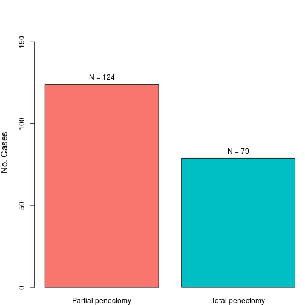 

```r
descriptive.categorical(Var)
```


|                  | No. Cases | %  |
|:-----------------|:---------:|:--:|
|Partial penectomy |    124    | 61 |
|Total penectomy   |     79    | 39 |

_Number of missing cases: 0 cases._

***

#### Histologic grade

```r
Var <- Data$Grade
plot.categorical(Var)
```

 

```r
descriptive.categorical(Var)
```


|        | No. Cases | %  |
|:-------|:---------:|:--:|
|Grade 1 |    52     | 26 |
|Grade 2 |    69     | 34 |
|Grade 3 |    82     | 40 |

_Number of missing cases: 0 cases._

***

#### Histologic subtype

```r
Var <- Data$Subtype
plot.categorical(Var, align = "h", left =8)
```

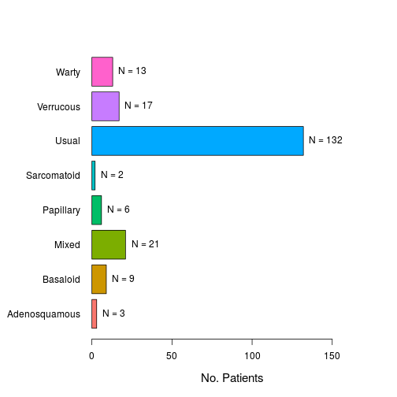 

```r
descriptive.categorical(Var)
```


|              | No. Cases |   %   |
|:-------------|:---------:|:-----:|
|Adenosquamous |      3    |  1.48 |
|Basaloid      |      9    |  4.43 |
|Mixed         |     21    | 10.34 |
|Papillary     |      6    |  2.96 |
|Sarcomatoid   |      2    |  0.99 |
|Usual         |    132    | 65.02 |
|Verrucous     |     17    |  8.37 |
|Warty         |     13    |  6.40 |

_Number of missing cases: 0 cases._

***

#### Tumor located in glans

```r
Var <- Data$Glans
plot.categorical(Var)
```

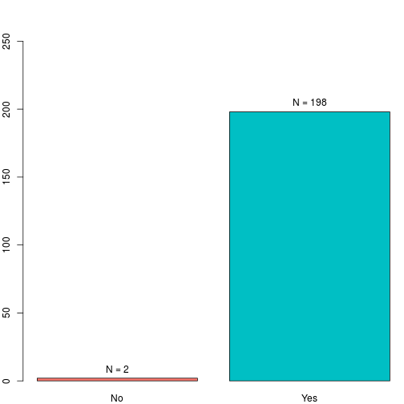 

```r
descriptive.categorical(Var)
```


|    | No. Cases | %  |
|:---|:---------:|:--:|
|No  |      2    |  1 |
|Yes |    198    | 99 |

_Number of missing cases: 3 cases._

***

#### Tumor located in coronal sulcus

```r
Var <- Data$Sulcus
plot.categorical(Var)
```

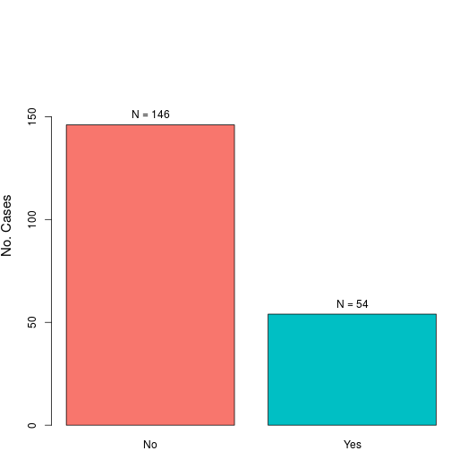 

```r
descriptive.categorical(Var)
```


|    | No. Cases | %  |
|:---|:---------:|:--:|
|No  |    146    | 73 |
|Yes |     54    | 27 |

_Number of missing cases: 3 cases._

***

#### Tumor located in Foreskin

```r
Var <- Data$Foreskin
plot.categorical(Var)
```

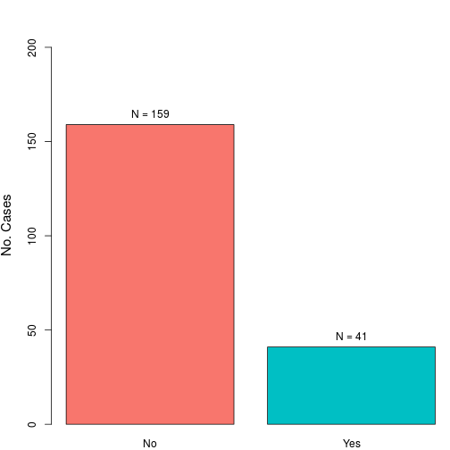 

```r
descriptive.categorical(Var)
```


|    | No. Cases | %  |
|:---|:---------:|:--:|
|No  |    159    | 80 |
|Yes |     41    | 20 |

_Number of missing cases: 3 cases._

***

#### Anatomical level of maximum tumor invasion

```r
Var <- Data$Level
plot.categorical(Var, align = "h", left = 9)
```

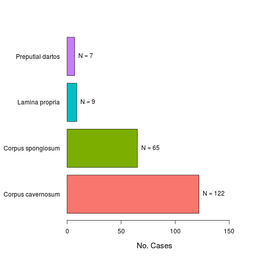 

```r
descriptive.categorical(Var)
```


|                  | No. Cases |  %   |
|:-----------------|:---------:|:----:|
|Corpus cavernosum |    122    | 60.1 |
|Corpus spongiosum |     65    | 32.0 |
|Lamina propria    |      9    |  4.4 |
|Preputial dartos  |      7    |  3.4 |

_Number of missing cases: 0 cases._

***

#### Tumor thickness in mm

```r
Var <- Data$Thickness
plot.numerical(Var, label = "Tumor Thickness, mm")
```

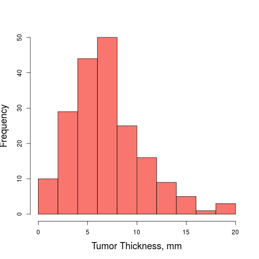 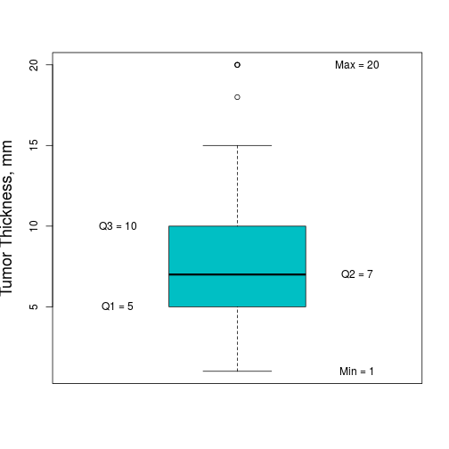 

```r
descriptive.numerical(Var)
```


|Statistics          | Values |
|:-------------------|:------:|
|Mean                |  7.5   |
|Standard Deviation  |  3.7   |
|Median              |   7    |
|Interquartile Range |   5    |
|Mininum             |   1    |
|Maximum             |   20   |

_Number of missing cases: 11 cases._

***

#### Tumor size in cm

```r
Var <- Data$Size
plot.numerical(Var, label = "Tumor Size, cm")
```

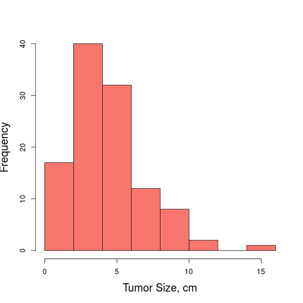 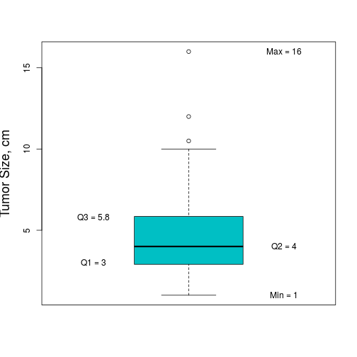 

```r
descriptive.numerical(Var)
```


|Statistics          | Values |
|:-------------------|:------:|
|Mean                |  4.7   |
|Standard Deviation  |  2.5   |
|Median              |   4    |
|Interquartile Range |  2.8   |
|Mininum             |   1    |
|Maximum             |   16   |

_Number of missing cases: 91 cases._

***

#### Patient's age in years

```r
Var <- Data$Age
plot.numerical(Var, label = "Patient's Age, years")
```

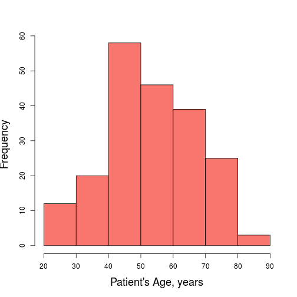 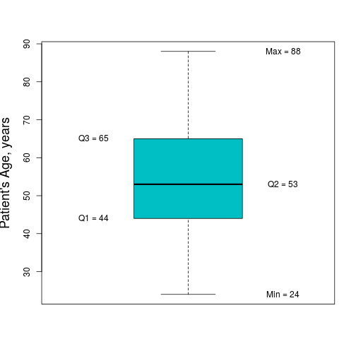 

```r
descriptive.numerical(Var)
```


|Statistics          | Values |
|:-------------------|:------:|
|Mean                |  53.9  |
|Standard Deviation  |  14.1  |
|Median              |   53   |
|Interquartile Range |   21   |
|Mininum             |   24   |
|Maximum             |   88   |

_Number of missing cases: 0 cases._

***

#### Bilateral inguinal lymphadenectomy

```r
Var <- Data$Lymphadenectomy
plot.categorical(Var)
```

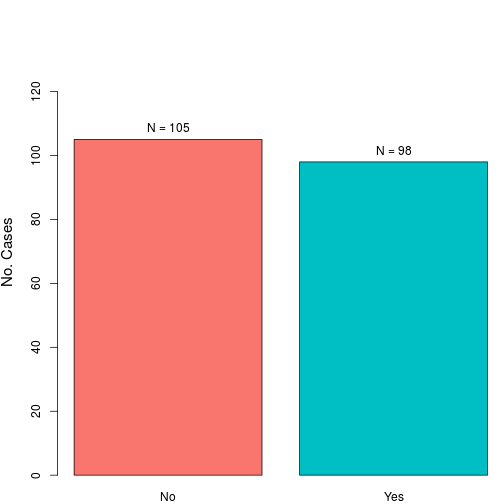 

```r
descriptive.categorical(Var)
```


|    | No. Cases | %  |
|:---|:---------:|:--:|
|No  |    105    | 52 |
|Yes |     98    | 48 |

_Number of missing cases: 0 cases._

***

#### Inguinal Lymph Node Metastasis

```r
Var <- Data$Mets
plot.categorical(Var)
```

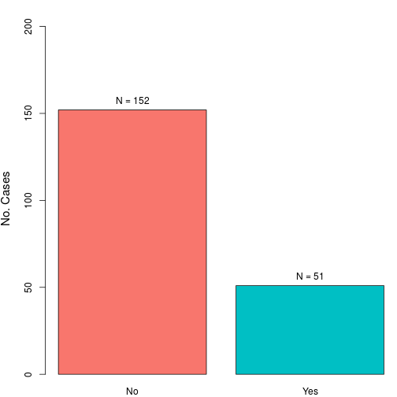 

```r
descriptive.categorical(Var)
```


|    | No. Cases | %  |
|:---|:---------:|:--:|
|No  |    152    | 75 |
|Yes |     51    | 25 |

_Number of missing cases: 0 cases._

***

#### Tumor invasion of penile urethra

```r
Var <- Data$Urethra
plot.categorical(Var)
```

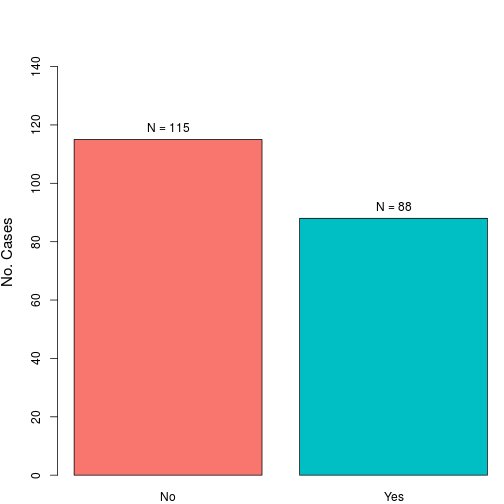 

```r
descriptive.categorical(Var)
```


|    | No. Cases | %  |
|:---|:---------:|:--:|
|No  |    115    | 57 |
|Yes |     88    | 43 |

_Number of missing cases: 0 cases._

***

#### Vascular invasion in primary tumor

```r
Var <- Data$Vascular
plot.categorical(Var)
```

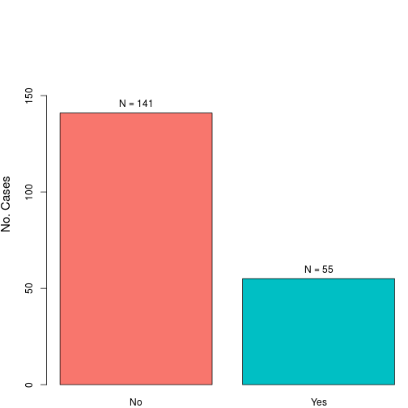 

```r
descriptive.categorical(Var)
```


|    | No. Cases | %  |
|:---|:---------:|:--:|
|No  |    141    | 72 |
|Yes |     55    | 28 |

_Number of missing cases: 7 cases._

***

#### Perineural invasion in primary tumor

```r
Var <- Data$Perineural
plot.categorical(Var)
```

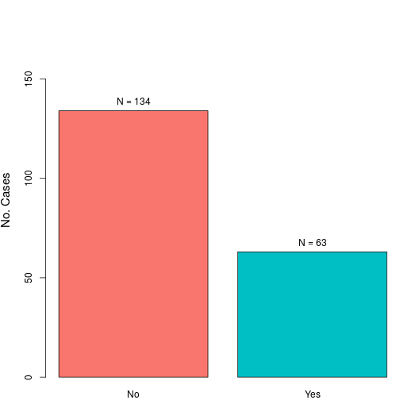 

```r
descriptive.categorical(Var)
```


|    | No. Cases | %  |
|:---|:---------:|:--:|
|No  |    134    | 68 |
|Yes |     63    | 32 |

_Number of missing cases: 6 cases._

***

#### Pathological T stage

```r
Var <- Data$pT
plot.categorical(Var)
```

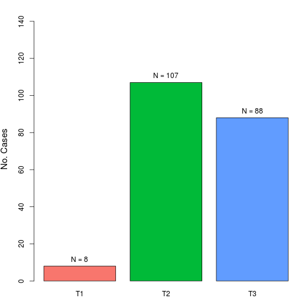 

```r
descriptive.categorical(Var)
```


|   | No. Cases |  %   |
|:--|:---------:|:----:|
|T1 |      8    |  3.9 |
|T2 |    107    | 52.7 |
|T3 |     88    | 43.3 |

_Number of missing cases: 0 cases._

***

#### Any tumor relapse (local, regional or systemic)

```r
Var <- Data$Relapse
plot.categorical(Var)
```

 

```r
descriptive.categorical(Var)
```


|    | No. Cases | %  |
|:---|:---------:|:--:|
|No  |    150    | 77 |
|Yes |     45    | 23 |

_Number of missing cases: 8 cases._

***

#### Local tumor relapse

```r
Var <- Data$Local
plot.categorical(Var)
```

 

```r
descriptive.categorical(Var)
```


|    | No. Cases | %  |
|:---|:---------:|:--:|
|No  |    37     | 82 |
|Yes |     8     | 18 |

_Number of missing cases: 158 cases._

***

#### Regional tumor relapse

```r
Var <- Data$Regional
plot.categorical(Var)
```

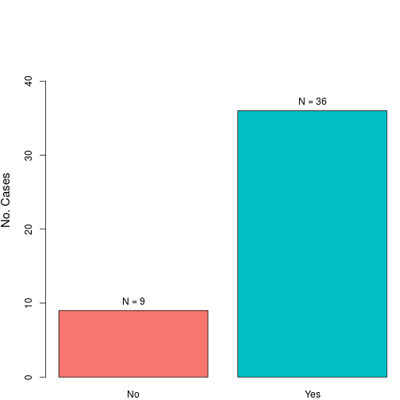 

```r
descriptive.categorical(Var)
```


|    | No. Cases | %  |
|:---|:---------:|:--:|
|No  |     9     | 20 |
|Yes |    36     | 80 |

_Number of missing cases: 158 cases._

***

#### Systemic tumor relapse

```r
Var <- Data$Systemic
plot.categorical(Var)
```

 

```r
descriptive.categorical(Var)
```


|    | No. Cases | %  |
|:---|:---------:|:--:|
|No  |    33     | 73 |
|Yes |    12     | 27 |

_Number of missing cases: 158 cases._

***

#### Follow-up length in months

```r
Var <- Data$FollowUp
plot.numerical(Var, label = "Follow-Up, Months")
```

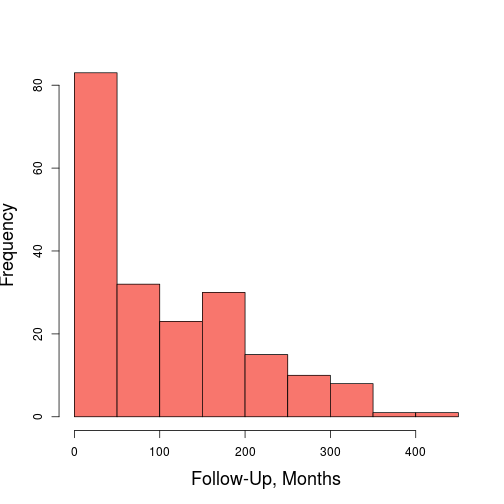 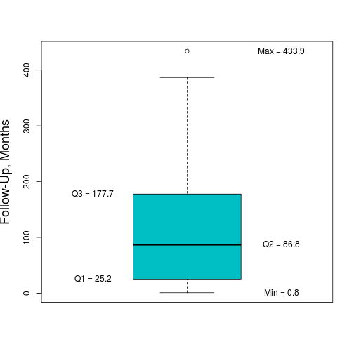 

```r
descriptive.numerical(Var)
```


|Statistics          | Values |
|:-------------------|:------:|
|Mean                | 108.1  |
|Standard Deviation  |  94.7  |
|Median              |  86.8  |
|Interquartile Range | 152.4  |
|Mininum             |  0.8   |
|Maximum             | 433.9  |

_Number of missing cases: 0 cases._

***

#### Patient's outcome

```r
Var <- Data$Outcome
plot.categorical(Var)
```

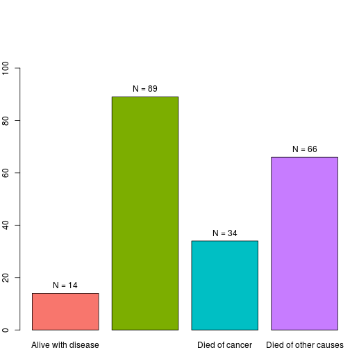 

```r
descriptive.categorical(Var)
```


|                      | No. Cases |  %   |
|:---------------------|:---------:|:----:|
|Alive with disease    |    14     |  6.9 |
|Alive without disease |    89     | 43.8 |
|Died of cancer        |    34     | 16.7 |
|Died of other causes  |    66     | 32.5 |

_Number of missing cases: 0 cases._

***

#### Clinical N stage

```r
Var <- Data$cN
plot.categorical(Var)
```

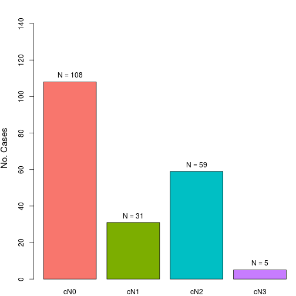 

```r
descriptive.categorical(Var)
```


|    | No. Cases |  %   |
|:---|:---------:|:----:|
|cN0 |    108    | 53.2 |
|cN1 |     31    | 15.3 |
|cN2 |     59    | 29.1 |
|cN3 |      5    |  2.5 |

_Number of missing cases: 0 cases._

***

#### Clinically positive inguinal lymph nodes

```r
Var <- Data$cN_Positive
plot.categorical(Var)
```

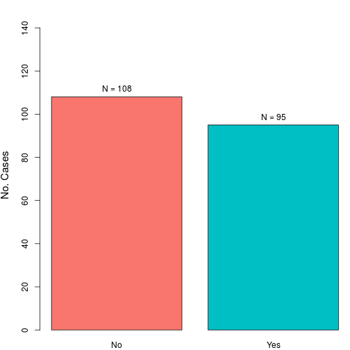 

```r
descriptive.categorical(Var)
```


|    | No. Cases | %  |
|:---|:---------:|:--:|
|No  |    108    | 53 |
|Yes |     95    | 47 |

_Number of missing cases: 0 cases._

***

#### Final nodal status

```r
Var <- Data$Final_Nodal
plot.categorical(Var)
```

 

```r
descriptive.categorical(Var)
```


|         | No. Cases | %  |
|:--------|:---------:|:--:|
|Negative |    132    | 65 |
|Positive |     71    | 35 |

_Number of missing cases: 0 cases._

***

#### Cancer-related death

```r
Var <- Data$DOD
plot.categorical(Var)
```

 

```r
descriptive.categorical(Var)
```


|    | No. Cases | %  |
|:---|:---------:|:--:|
|No  |    169    | 83 |
|Yes |     34    | 17 |

_Number of missing cases: 0 cases._

***

#### Solsona _et al_ risk groups

```r
Var <- Data$Solsona
plot.categorical(Var)
```

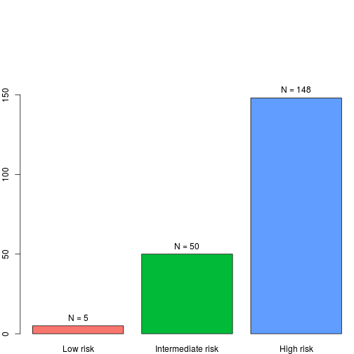 

```r
descriptive.categorical(Var)
```


|                  | No. Cases |  %   |
|:-----------------|:---------:|:----:|
|Low risk          |      5    |  2.5 |
|Intermediate risk |     50    | 24.6 |
|High risk         |    148    | 72.9 |

_Number of missing cases: 0 cases._

***

#### European Association of Urology risk groups

```r
Var <- Data$EAU
plot.categorical(Var)
```

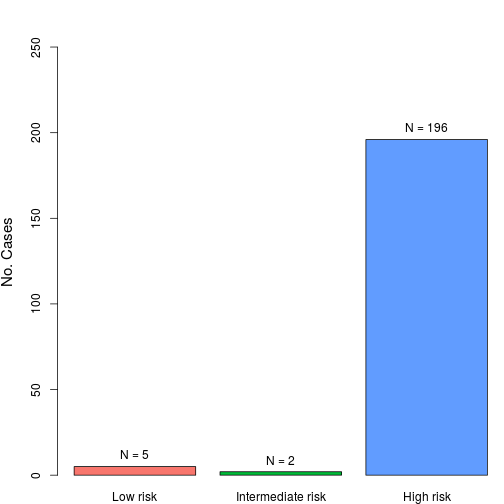 

```r
descriptive.categorical(Var)
```


|                  | No. Cases |   %   |
|:-----------------|:---------:|:-----:|
|Low risk          |      5    |  2.46 |
|Intermediate risk |      2    |  0.99 |
|High risk         |    196    | 96.55 |

_Number of missing cases: 0 cases._

***

#### Hungerhuber _et al_ risk groups

```r
Var <- Data$Hungerhuber
plot.categorical(Var)
```

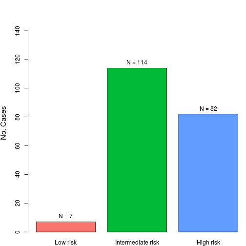 

```r
descriptive.categorical(Var)
```


|                  | No. Cases |  %   |
|:-----------------|:---------:|:----:|
|Low risk          |      7    |  3.4 |
|Intermediate risk |    114    | 56.2 |
|High risk         |     82    | 40.4 |

_Number of missing cases: 0 cases._

***

### <a name="InferentialFNS">Inferential Statistics: Final Nodal Status</a>

```r
Var2 <- Data$Final_Nodal
```

#### Final nodal status and surgical procedure

```r
Var1 <- Data$Procedure
plot.categorical.group(Var1, Var2)
```

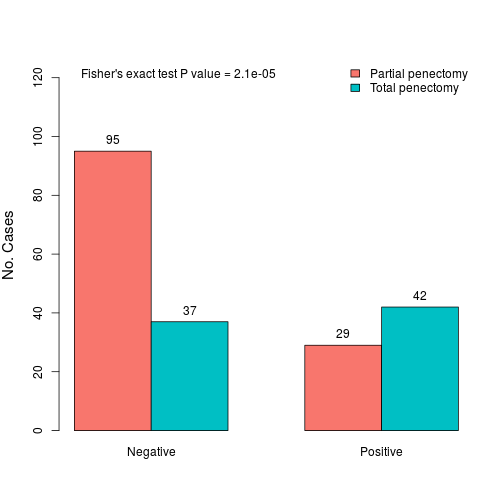 

```r
descriptive.categorical.group(Var1, Var2)
```


|                  | Negative | %  | Positive |  %   |
|:-----------------|:--------:|:--:|:--------:|:----:|
|Partial penectomy |    95    | 72 |    29    | 40.8 |
|Total penectomy   |    37    | 28 |    42    | 59.2 |

***

#### Final nodal status and histologic grade

```r
Var1 <- Data$Grade
plot.categorical.group(Var1, Var2)
```

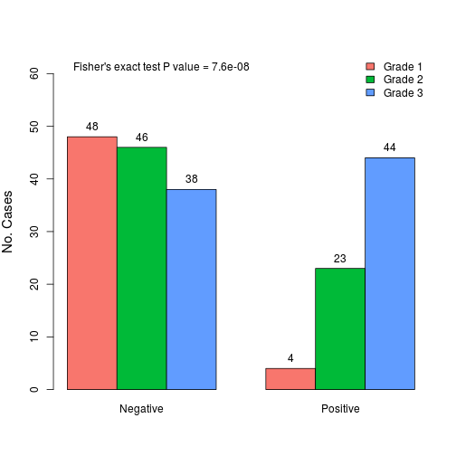 

```r
descriptive.categorical.group(Var1, Var2)
```


|        | Negative |  %   | Positive |  %   |
|:-------|:--------:|:----:|:--------:|:----:|
|Grade 1 |    48    | 36.4 |    4     | 5.6  |
|Grade 2 |    46    | 34.8 |    23    | 32.4 |
|Grade 3 |    38    | 28.8 |    44    | 62.0 |

***

#### Final nodal status and glans location

```r
Var1 <- Data$Glans
plot.categorical.group(Var1, Var2)
```

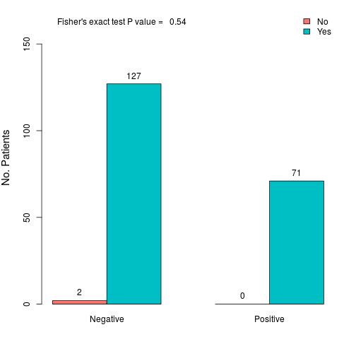 

```r
descriptive.categorical.group(Var1, Var2)
```


|    | Negative |  %   | Positive |  %  |
|:---|:--------:|:----:|:--------:|:---:|
|No  |    2     | 1.6  |    0     |  0  |
|Yes |   127    | 98.4 |    71    | 100 |

***

#### Final nodal status and coronal sulcus location

```r
Var1 <- Data$Sulcus
plot.categorical.group(Var1, Var2)
```

 

```r
descriptive.categorical.group(Var1, Var2)
```


|    | Negative |  %   | Positive |  %   |
|:---|:--------:|:----:|:--------:|:----:|
|No  |    95    | 73.6 |    51    | 71.8 |
|Yes |    34    | 26.4 |    20    | 28.2 |

***

#### Final nodal status and foreskin location

```r
Var1 <- Data$Glans
plot.categorical.group(Var1, Var2)
```

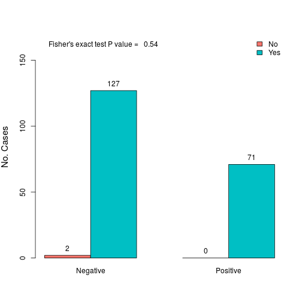 

```r
descriptive.categorical.group(Var1, Var2)
```


|    | Negative |  %   | Positive |  %  |
|:---|:--------:|:----:|:--------:|:---:|
|No  |    2     | 1.6  |    0     |  0  |
|Yes |   127    | 98.4 |    71    | 100 |

***

#### Final nodal status and anatomical level

```r
Var1 <- Data$Level
plot.categorical.group(Var1, Var2)
```

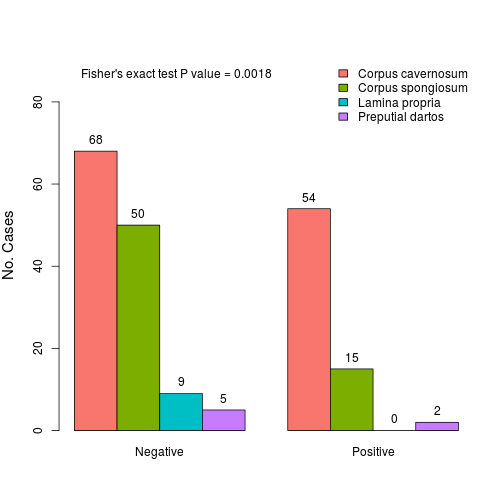 

```r
descriptive.categorical.group(Var1, Var2)
```


|                  | Negative |  %   | Positive |  %   |
|:-----------------|:--------:|:----:|:--------:|:----:|
|Corpus cavernosum |    68    | 51.5 |    54    | 76.1 |
|Corpus spongiosum |    50    | 37.9 |    15    | 21.1 |
|Lamina propria    |    9     | 6.8  |    0     | 0.0  |
|Preputial dartos  |    5     | 3.8  |    2     | 2.8  |

***

#### Final nodal status and tumor thickness

```r
Var1 <- Data$Thickness
boxplot.kruskal(Var1, Var2)
```

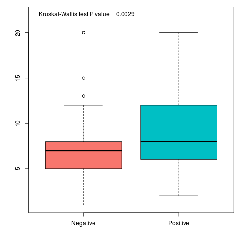 

```r
descriptive.numerical.group(Var1, Var2)
```


|                    | Negative | Positive |
|:-------------------|:--------:|:--------:|
|Mean                |   6.8    |   8.7    |
|Standard Deviation  |   3.3    |   4.1    |
|Median              |   7.0    |   8.0    |
|Interquartile Range |   3.0    |   6.0    |
|Minimum             |   1.0    |   2.0    |
|Maximum             |   20.0   |   20.0   |

***

#### Final nodal status and tumor size

```r
Var1 <- Data$Size
boxplot.kruskal(Var1, Var2)
```

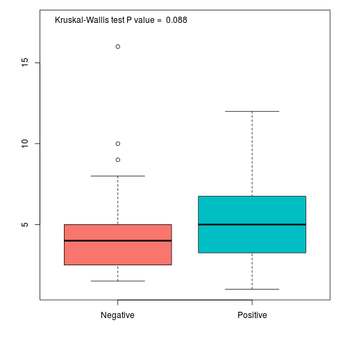 

```r
descriptive.numerical.group(Var1, Var2)
```


|                    | Negative | Positive |
|:-------------------|:--------:|:--------:|
|Mean                |   4.4    |   5.2    |
|Standard Deviation  |   2.4    |   2.7    |
|Median              |   4.0    |   5.0    |
|Interquartile Range |   2.5    |   3.5    |
|Minimum             |   1.5    |   1.0    |
|Maximum             |   16.0   |   12.0   |

***

#### Final nodal status and patient's age

```r
Var1 <- Data$Age
boxplot.kruskal(Var1, Var2)
```

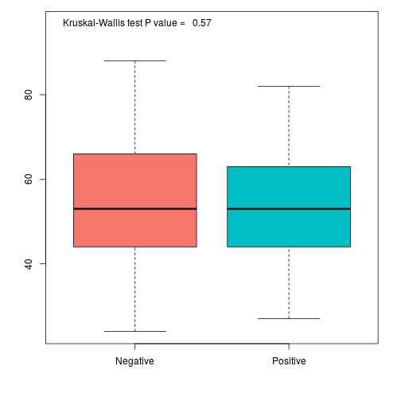 

```r
descriptive.numerical.group(Var1, Var2)
```


|                    | Negative | Positive |
|:-------------------|:--------:|:--------:|
|Mean                |   54.3   |   53.0   |
|Standard Deviation  |   14.5   |   13.4   |
|Median              |   53.0   |   53.0   |
|Interquartile Range |   22.0   |   19.0   |
|Minimum             |   24.0   |   27.0   |
|Maximum             |   88.0   |   82.0   |

***

#### Final nodal status and urethral invasion

```r
Var1 <- Data$Urethra
plot.categorical.group(Var1, Var2)
```

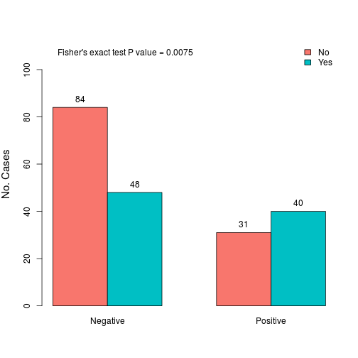 

```r
descriptive.categorical.group(Var1, Var2)
```


|    | Negative |  %   | Positive |  %   |
|:---|:--------:|:----:|:--------:|:----:|
|No  |    84    | 63.6 |    31    | 43.7 |
|Yes |    48    | 36.4 |    40    | 56.3 |

***

#### Final nodal status and vascular invasion

```r
Var1 <- Data$Vascular
plot.categorical.group(Var1, Var2)
```

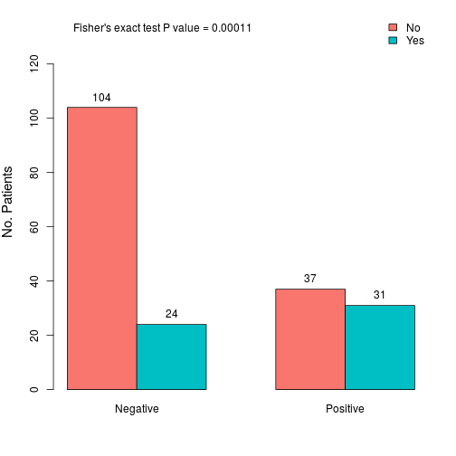 

```r
descriptive.categorical.group(Var1, Var2)
```


|    | Negative |  %   | Positive |  %   |
|:---|:--------:|:----:|:--------:|:----:|
|No  |   104    | 81.2 |    37    | 54.4 |
|Yes |    24    | 18.8 |    31    | 45.6 |

***

#### Final nodal status and perineural invasion

```r
Var1 <- Data$Perineural
plot.categorical.group(Var1, Var2)
```

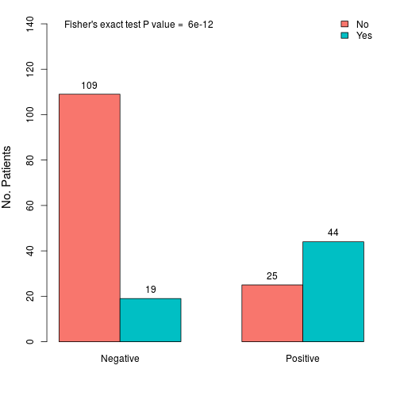 

```r
descriptive.categorical.group(Var1, Var2)
```


|    | Negative |  %   | Positive |  %   |
|:---|:--------:|:----:|:--------:|:----:|
|No  |   109    | 85.2 |    25    | 36.2 |
|Yes |    19    | 14.8 |    44    | 63.8 |

***

#### Final nodal status and clinical N stage

```r
Var1 <- Data$cN
plot.categorical.group(Var1, Var2)
```

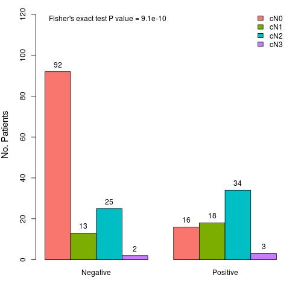 

```r
descriptive.categorical.group(Var1, Var2)
```


|    | Negative |  %   | Positive |  %   |
|:---|:--------:|:----:|:--------:|:----:|
|cN0 |    92    | 69.7 |    16    | 22.5 |
|cN1 |    13    | 9.8  |    18    | 25.4 |
|cN2 |    25    | 18.9 |    34    | 47.9 |
|cN3 |    2     | 1.5  |    3     | 4.2  |

***

#### Final nodal status and pathological T stage

```r
Var1 <- Data$pT
plot.categorical.group(Var1, Var2)
```

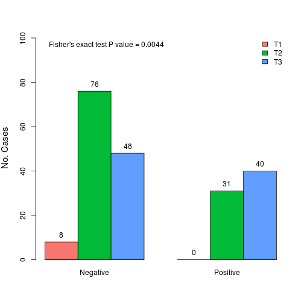 

```r
descriptive.categorical.group(Var1, Var2)
```


|   | Negative |  %   | Positive |  %   |
|:--|:--------:|:----:|:--------:|:----:|
|T1 |    8     | 6.1  |    0     | 0.0  |
|T2 |    76    | 57.6 |    31    | 43.7 |
|T3 |    48    | 36.4 |    40    | 56.3 |

***

#### Final nodal status and (any) tumor relapse

```r
Var1 <- Data$Relapse
plot.categorical.group(Var1, Var2)
```

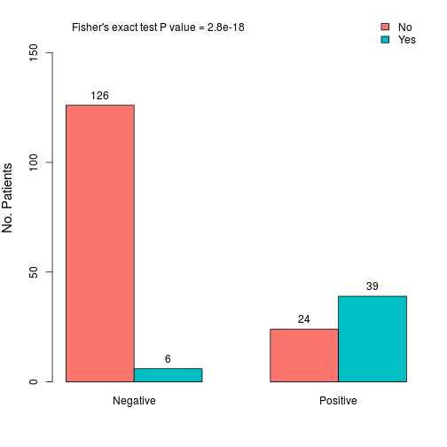 

```r
descriptive.categorical.group(Var1, Var2)
```


|    | Negative |  %   | Positive |  %   |
|:---|:--------:|:----:|:--------:|:----:|
|No  |   126    | 95.5 |    24    | 38.1 |
|Yes |    6     | 4.5  |    39    | 61.9 |

***

#### Final nodal status and local relapse

```r
Var1 <- Data$Local
plot.categorical.group(Var1, Var2)
```

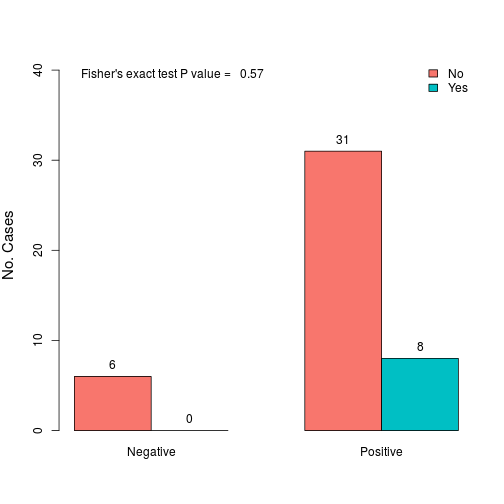 

```r
descriptive.categorical.group(Var1, Var2)
```


|    | Negative |  %  | Positive |  %   |
|:---|:--------:|:---:|:--------:|:----:|
|No  |    6     | 100 |    31    | 79.5 |
|Yes |    0     |  0  |    8     | 20.5 |

***

#### Final nodal status and regional relapse

```r
Var1 <- Data$Regional
plot.categorical.group(Var1, Var2)
```

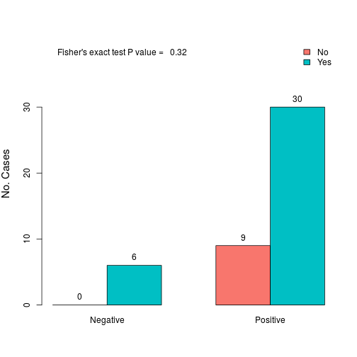 

```r
descriptive.categorical.group(Var1, Var2)
```


|    | Negative |  %  | Positive |  %   |
|:---|:--------:|:---:|:--------:|:----:|
|No  |    0     |  0  |    9     | 23.1 |
|Yes |    6     | 100 |    30    | 76.9 |

***

#### Final nodal status and systemic relapse

```r
Var1 <- Data$Systemic
plot.categorical.group(Var1, Var2)
```

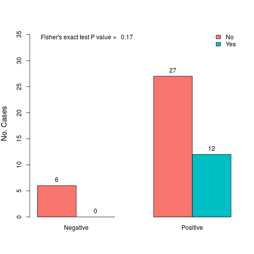 

```r
descriptive.categorical.group(Var1, Var2)
```


|    | Negative |  %  | Positive |  %   |
|:---|:--------:|:---:|:--------:|:----:|
|No  |    6     | 100 |    27    | 69.2 |
|Yes |    0     |  0  |    12    | 30.8 |

***

#### Final nodal status and Solsona _et al_ risk groups

```r
Var1 <- Data$Solsona
plot.categorical.group(Var1, Var2)
```

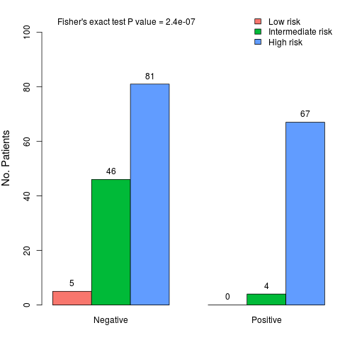 

```r
descriptive.categorical.group(Var1, Var2)
```


|                  | Negative |  %   | Positive |  %   |
|:-----------------|:--------:|:----:|:--------:|:----:|
|Low risk          |    5     | 3.8  |    0     | 0.0  |
|Intermediate risk |    46    | 34.8 |    4     | 5.6  |
|High risk         |    81    | 61.4 |    67    | 94.4 |

***

#### Final nodal status and EAU risk groups

```r
Var1 <- Data$EAU
plot.categorical.group(Var1, Var2)
```

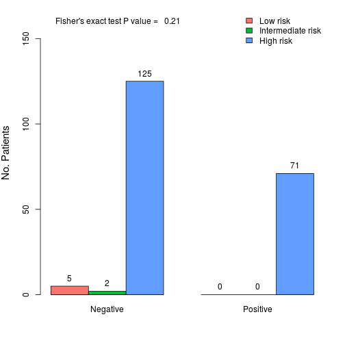 

```r
descriptive.categorical.group(Var1, Var2)
```


|                  | Negative |  %   | Positive |  %  |
|:-----------------|:--------:|:----:|:--------:|:---:|
|Low risk          |    5     | 3.8  |    0     |  0  |
|Intermediate risk |    2     | 1.5  |    0     |  0  |
|High risk         |   125    | 94.7 |    71    | 100 |

***

#### Final nodal status and Hungerhuber _et al_ risk groups

```r
Var1 <- Data$Hungerhuber
plot.categorical.group(Var1, Var2)
```

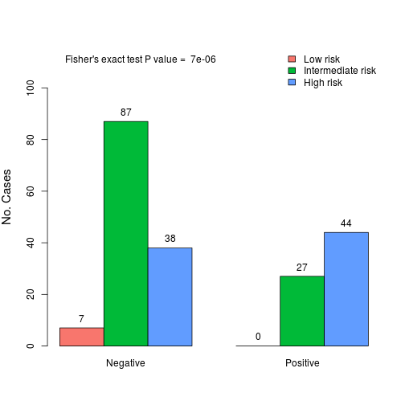 

```r
descriptive.categorical.group(Var1, Var2)
```


|                  | Negative |  %   | Positive | %  |
|:-----------------|:--------:|:----:|:--------:|:--:|
|Low risk          |    7     | 5.3  |    0     | 0  |
|Intermediate risk |    87    | 65.9 |    27    | 38 |
|High risk         |    38    | 28.8 |    44    | 62 |

***

### <a name="InferentialDOD">Inferential Statistics: Cancer-Related Death</a>

```r
Var2 <- Data$DOD
```

#### Cancer-related death and surgical procedure

```r
Var1 <- Data$Procedure
plot.categorical.group(Var1, Var2)
```

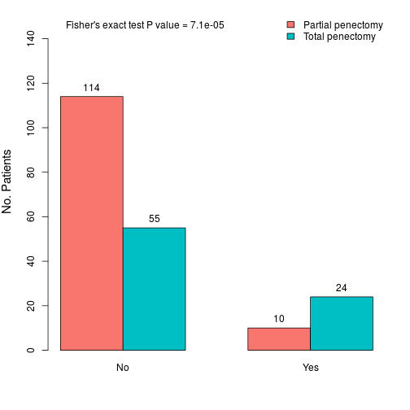 

```r
descriptive.categorical.group(Var1, Var2)
```


|                  | No  |  %   | Yes |  %   |
|:-----------------|:---:|:----:|:---:|:----:|
|Partial penectomy | 114 | 67.5 | 10  | 29.4 |
|Total penectomy   | 55  | 32.5 | 24  | 70.6 |

***

#### Cancer-related death and histologic grade

```r
Var1 <- Data$Grade
plot.categorical.group(Var1, Var2)
```

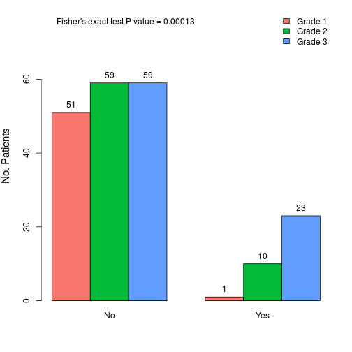 

```r
descriptive.categorical.group(Var1, Var2)
```


|        | No |  %   | Yes |  %   |
|:-------|:--:|:----:|:---:|:----:|
|Grade 1 | 51 | 30.2 |  1  | 2.9  |
|Grade 2 | 59 | 34.9 | 10  | 29.4 |
|Grade 3 | 59 | 34.9 | 23  | 67.6 |

***

#### Cancer-related death and glans location

```r
Var1 <- Data$Glans
plot.categorical.group(Var1, Var2)
```

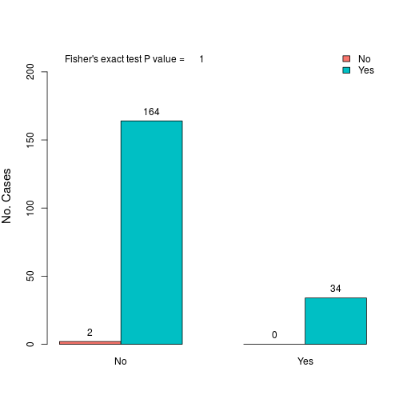 

```r
descriptive.categorical.group(Var1, Var2)
```


|    | No  |  %   | Yes |  %  |
|:---|:---:|:----:|:---:|:---:|
|No  |  2  | 1.2  |  0  |  0  |
|Yes | 164 | 98.8 | 34  | 100 |

***

#### Cancer-related death and coronal sulcus location

```r
Var1 <- Data$Sulcus
plot.categorical.group(Var1, Var2)
```

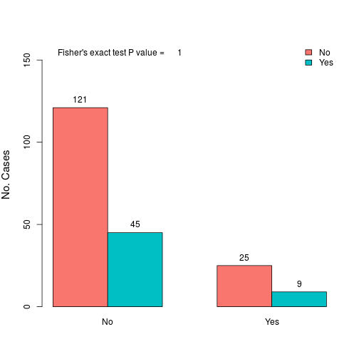 

```r
descriptive.categorical.group(Var1, Var2)
```


|    | No  |  %   | Yes |  %   |
|:---|:---:|:----:|:---:|:----:|
|No  | 121 | 72.9 | 25  | 73.5 |
|Yes | 45  | 27.1 |  9  | 26.5 |

***

#### Cancer-related death and foreskin location

```r
Var1 <- Data$Glans
plot.categorical.group(Var1, Var2)
```

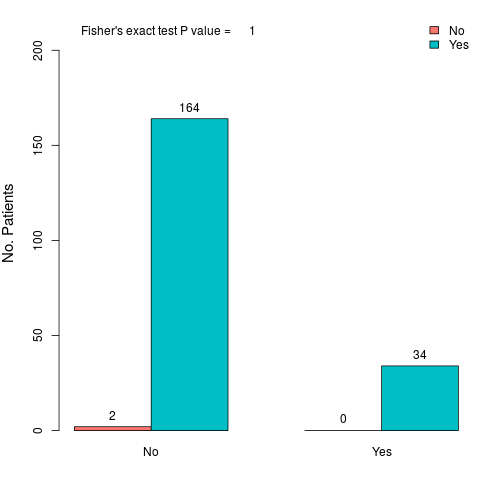 

```r
descriptive.categorical.group(Var1, Var2)
```


|    | No  |  %   | Yes |  %  |
|:---|:---:|:----:|:---:|:---:|
|No  |  2  | 1.2  |  0  |  0  |
|Yes | 164 | 98.8 | 34  | 100 |

***

#### Cancer-related death and anatomical level

```r
Var1 <- Data$Level
plot.categorical.group(Var1, Var2)
```

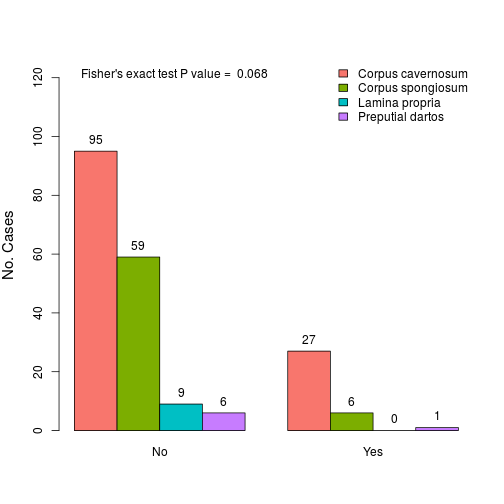 

```r
descriptive.categorical.group(Var1, Var2)
```


|                  | No |  %   | Yes |  %   |
|:-----------------|:--:|:----:|:---:|:----:|
|Corpus cavernosum | 95 | 56.2 | 27  | 79.4 |
|Corpus spongiosum | 59 | 34.9 |  6  | 17.6 |
|Lamina propria    | 9  | 5.3  |  0  | 0.0  |
|Preputial dartos  | 6  | 3.6  |  1  | 2.9  |

***

#### Cancer-related death and tumor thickness

```r
Var1 <- Data$Thickness
boxplot.kruskal(Var1, Var2)
```

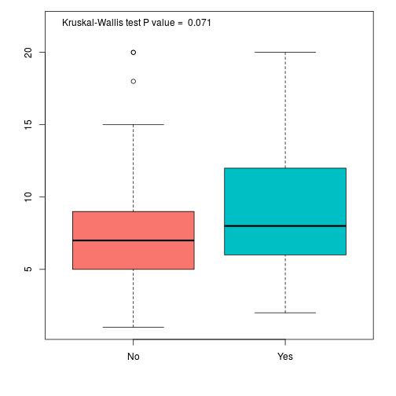 

```r
descriptive.numerical.group(Var1, Var2)
```


|                    |  No  | Yes  |
|:-------------------|:----:|:----:|
|Mean                | 7.3  | 8.7  |
|Standard Deviation  | 3.6  | 4.2  |
|Median              | 7.0  | 8.0  |
|Interquartile Range | 4.0  | 6.0  |
|Minimum             | 1.0  | 2.0  |
|Maximum             | 20.0 | 20.0 |

***

#### Cancer-related death and tumor size

```r
Var1 <- Data$Size
boxplot.kruskal(Var1, Var2)
```

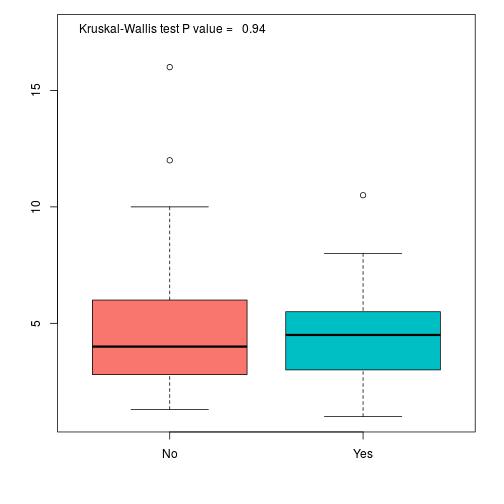 

```r
descriptive.numerical.group(Var1, Var2)
```


|                    |  No  | Yes  |
|:-------------------|:----:|:----:|
|Mean                | 4.7  | 4.6  |
|Standard Deviation  | 2.6  | 2.4  |
|Median              | 4.0  | 4.5  |
|Interquartile Range | 3.1  | 2.4  |
|Minimum             | 1.3  | 1.0  |
|Maximum             | 16.0 | 10.5 |

***

#### Cancer-related death and patient's age

```r
Var1 <- Data$Age
boxplot.kruskal(Var1, Var2)
```

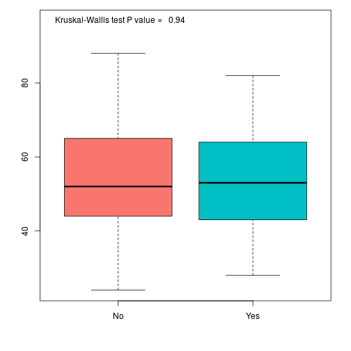 

```r
descriptive.numerical.group(Var1, Var2)
```


|                    |  No  | Yes  |
|:-------------------|:----:|:----:|
|Mean                | 53.9 | 53.8 |
|Standard Deviation  | 14.3 | 13.3 |
|Median              | 52.0 | 53.0 |
|Interquartile Range | 21.0 | 19.8 |
|Minimum             | 24.0 | 28.0 |
|Maximum             | 88.0 | 82.0 |

***

#### Cancer-related death and urethral invasion

```r
Var1 <- Data$Urethra
plot.categorical.group(Var1, Var2)
```

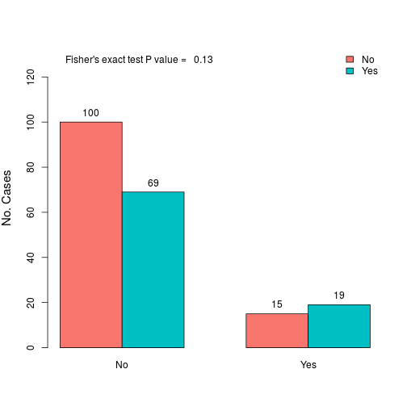 

```r
descriptive.categorical.group(Var1, Var2)
```


|    | No  |  %   | Yes |  %   |
|:---|:---:|:----:|:---:|:----:|
|No  | 100 | 59.2 | 15  | 44.1 |
|Yes | 69  | 40.8 | 19  | 55.9 |

***

#### Cancer-related death and vascular invasion

```r
Var1 <- Data$Vascular
plot.categorical.group(Var1, Var2)
```

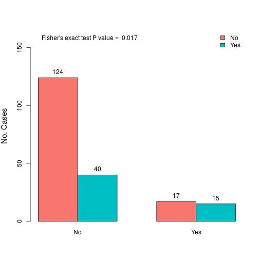 

```r
descriptive.categorical.group(Var1, Var2)
```


|    | No  |  %   | Yes |  %   |
|:---|:---:|:----:|:---:|:----:|
|No  | 124 | 75.6 | 17  | 53.1 |
|Yes | 40  | 24.4 | 15  | 46.9 |

***

#### Cancer-related death and perineural invasion

```r
Var1 <- Data$Perineural
plot.categorical.group(Var1, Var2)
```

 

```r
descriptive.categorical.group(Var1, Var2)
```


|    | No  |  %   | Yes |  %   |
|:---|:---:|:----:|:---:|:----:|
|No  | 122 | 73.9 | 12  | 37.5 |
|Yes | 43  | 26.1 | 20  | 62.5 |

***

#### Cancer-related death and clinical N stage

```r
Var1 <- Data$cN
plot.categorical.group(Var1, Var2)
```

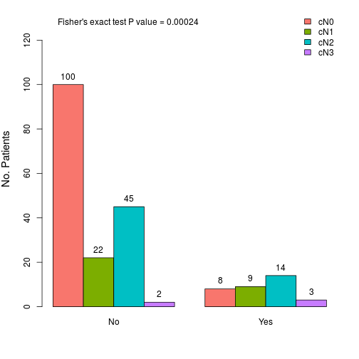 

```r
descriptive.categorical.group(Var1, Var2)
```


|    | No  |  %   | Yes |  %   |
|:---|:---:|:----:|:---:|:----:|
|cN0 | 100 | 59.2 |  8  | 23.5 |
|cN1 | 22  | 13.0 |  9  | 26.5 |
|cN2 | 45  | 26.6 | 14  | 41.2 |
|cN3 |  2  | 1.2  |  3  | 8.8  |

***

#### Cancer-related death and pathological T stage

```r
Var1 <- Data$pT
plot.categorical.group(Var1, Var2)
```

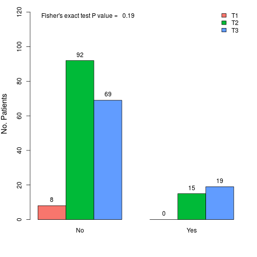 

```r
descriptive.categorical.group(Var1, Var2)
```


|   | No |  %   | Yes |  %   |
|:--|:--:|:----:|:---:|:----:|
|T1 | 8  | 4.7  |  0  | 0.0  |
|T2 | 92 | 54.4 | 15  | 44.1 |
|T3 | 69 | 40.8 | 19  | 55.9 |

***

#### Cancer-related death and (any) tumor relapse

```r
Var1 <- Data$Relapse
plot.categorical.group(Var1, Var2)
```

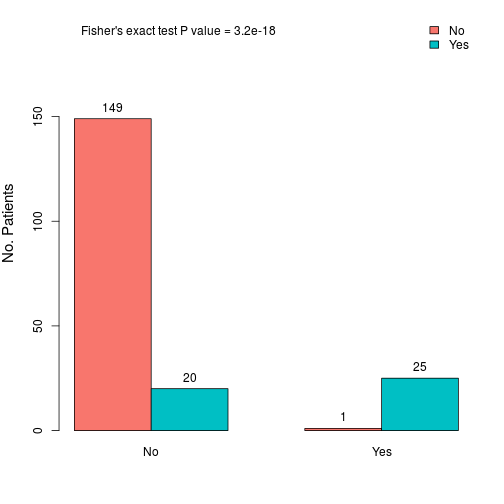 

```r
descriptive.categorical.group(Var1, Var2)
```


|    | No  |  %   | Yes |  %   |
|:---|:---:|:----:|:---:|:----:|
|No  | 149 | 88.2 |  1  | 3.8  |
|Yes | 20  | 11.8 | 25  | 96.2 |

***

#### Cancer-related death and local relapse

```r
Var1 <- Data$Local
plot.categorical.group(Var1, Var2)
```

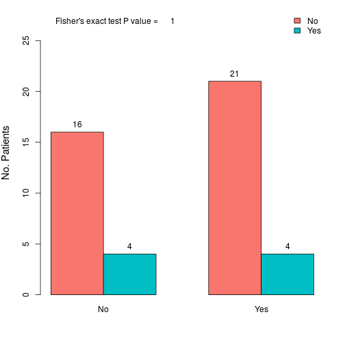 

```r
descriptive.categorical.group(Var1, Var2)
```


|    | No | %  | Yes | %  |
|:---|:--:|:--:|:---:|:--:|
|No  | 16 | 80 | 21  | 84 |
|Yes | 4  | 20 |  4  | 16 |

***

#### Cancer-related death and regional relapse

```r
Var1 <- Data$Regional
plot.categorical.group(Var1, Var2)
```

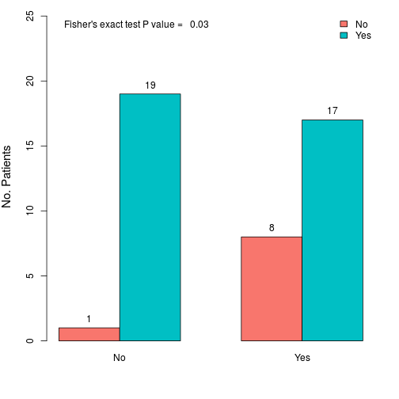 

```r
descriptive.categorical.group(Var1, Var2)
```


|    | No | %  | Yes | %  |
|:---|:--:|:--:|:---:|:--:|
|No  | 1  | 5  |  8  | 32 |
|Yes | 19 | 95 | 17  | 68 |

***

#### Cancer-related death and systemic relapse

```r
Var1 <- Data$Systemic
plot.categorical.group(Var1, Var2)
```

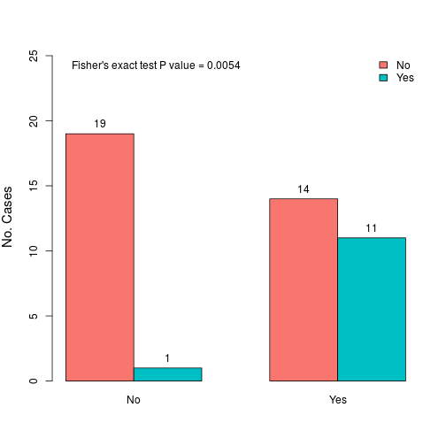 

```r
descriptive.categorical.group(Var1, Var2)
```


|    | No | %  | Yes | %  |
|:---|:--:|:--:|:---:|:--:|
|No  | 19 | 95 | 14  | 56 |
|Yes | 1  | 5  | 11  | 44 |

***

#### Cancer-related death and Solsona _et al_ risk groups

```r
Var1 <- Data$Solsona
plot.categorical.group(Var1, Var2)
```

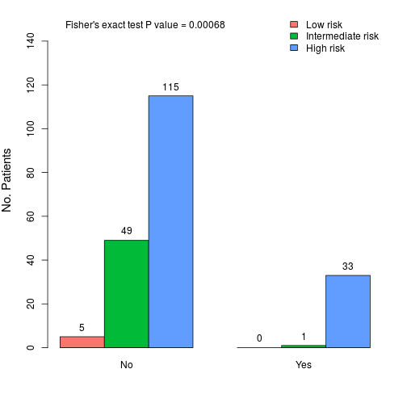 

```r
descriptive.categorical.group(Var1, Var2)
```


|                  | No  | %  | Yes |  %   |
|:-----------------|:---:|:--:|:---:|:----:|
|Low risk          |  5  | 3  |  0  | 0.0  |
|Intermediate risk | 49  | 29 |  1  | 2.9  |
|High risk         | 115 | 68 | 33  | 97.1 |

***

#### Cancer-related death and EAU risk groups

```r
Var1 <- Data$EAU
plot.categorical.group(Var1, Var2)
```

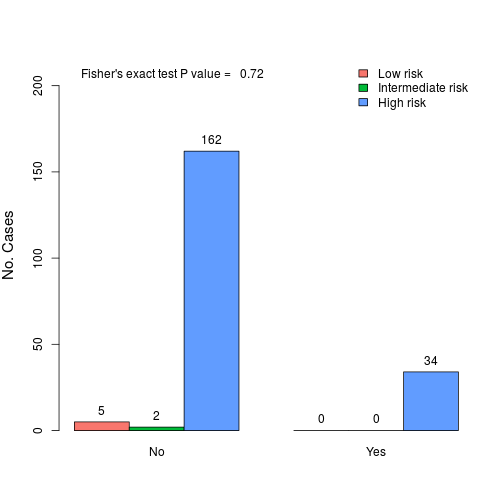 

```r
descriptive.categorical.group(Var1, Var2)
```


|                  | No  |  %   | Yes |  %  |
|:-----------------|:---:|:----:|:---:|:---:|
|Low risk          |  5  | 3.0  |  0  |  0  |
|Intermediate risk |  2  | 1.2  |  0  |  0  |
|High risk         | 162 | 95.9 | 34  | 100 |

***

#### Cancer-related death and Hungerhuber _et al_ risk groups

```r
Var1 <- Data$Hungerhuber
plot.categorical.group(Var1, Var2)
```

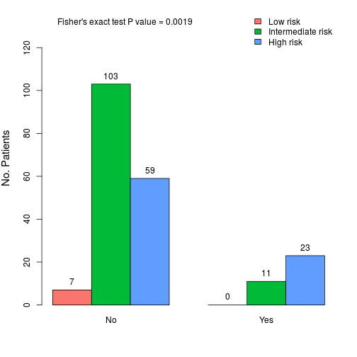 

```r
descriptive.categorical.group(Var1, Var2)
```


|                  | No  |  %   | Yes |  %   |
|:-----------------|:---:|:----:|:---:|:----:|
|Low risk          |  7  | 4.1  |  0  | 0.0  |
|Intermediate risk | 103 | 60.9 | 11  | 32.4 |
|High risk         | 59  | 34.9 | 23  | 67.6 |

***

### <a name="SurvivalFNS">Survival Analysis: Final Nodal Status</a>

```r
# Defining outcome variable
Status <- Data$Final_Nodal
# Creating dicotomic variables from numerical variables for plotting
Thickness_Median <- factor(ifelse(Data$Thickness > median(Data$Thickness, na.rm = TRUE), c("Above Median Thickness"), c("Below Median Thickness")))
Age_Median <- factor(ifelse(Data$Age > median(Data$Age, na.rm = TRUE), c("Above Median Age"), c("Below Median Age")))
# By surgical procedure
with(Data, survival.plot(Procedure, FollowUp, Status, title = "Final Nodal Status by Surgical Procedure"))
```

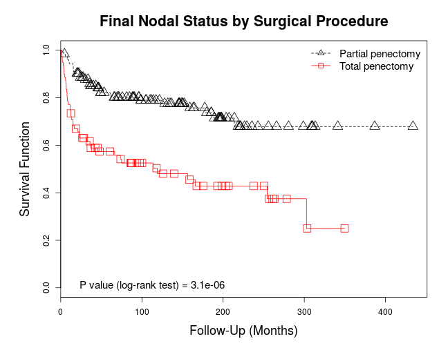 

```r
# By histologic grade
with(Data, survival.plot(Grade, FollowUp, Status, title = "Final Nodal Status by Histologic Grade", position = "bottomright"))
```

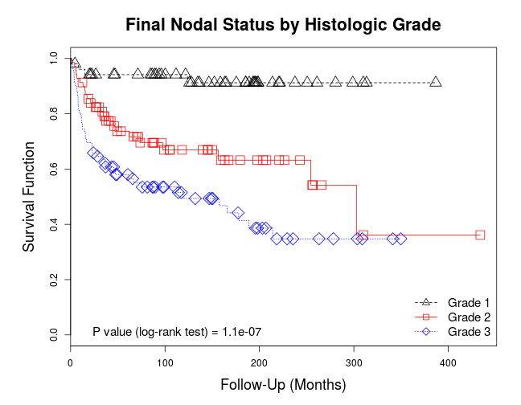 

```r
# By glans invasion
with(Data, survival.plot(Glans, FollowUp, Status, title = "Final Nodal Status by Glans Invasion"))
```

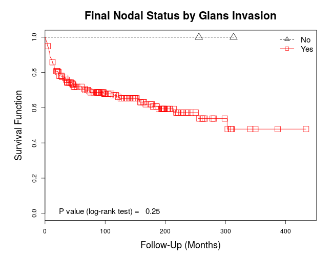 

```r
# By coronal sulcus invasion
with(Data, survival.plot(Sulcus, FollowUp, Status, title = "Final Nodal Status by Coronal Sulcus Invasion"))
```

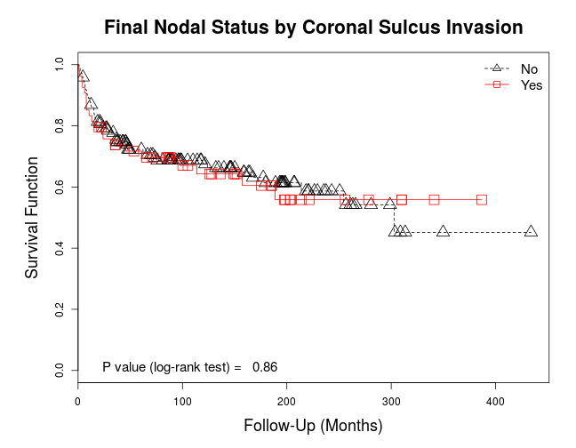 

```r
# By foreskin invasion
with(Data, survival.plot(Foreskin, FollowUp, Status, title = "Final Nodal Status by Foreskin Invasion"))
```

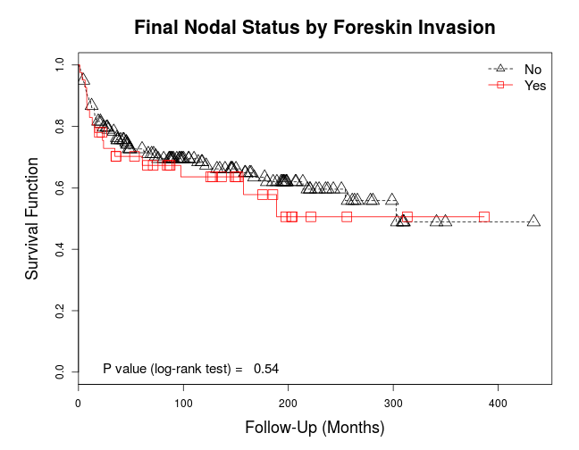 

```r
# By anatomical level
with(Data, survival.plot(Level, FollowUp, Status, title = "Final Nodal Status by Anatomical Level"))
```

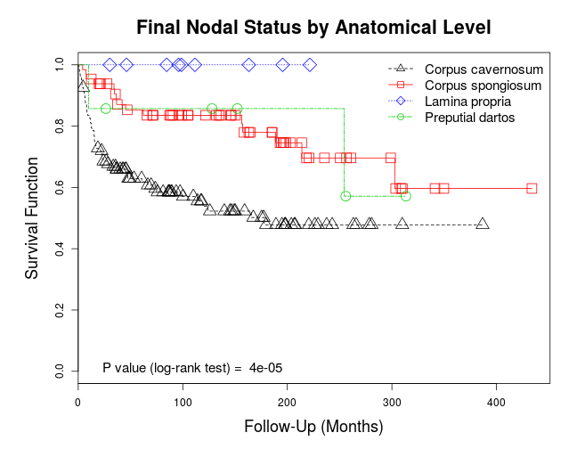 

```r
# By median tumor thickness
with(Data, survival.plot(Thickness_Median, FollowUp, Status, title = "Final Nodal Status by Median Tumor Thickness"))
```

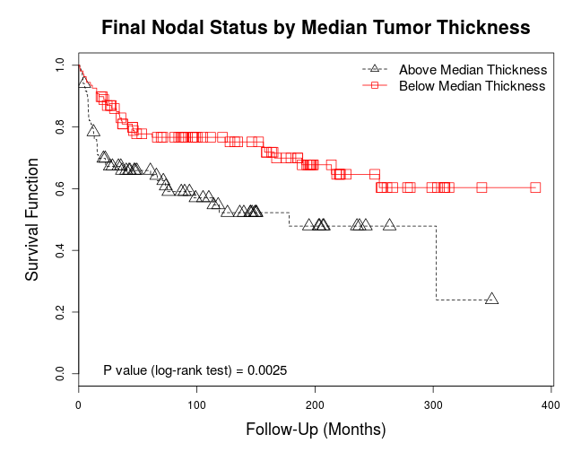 

```r
# By median patient's age
with(Data, survival.plot(Age_Median, FollowUp, Status, title = "Final Nodal Status by Median Patient's Age"))
```

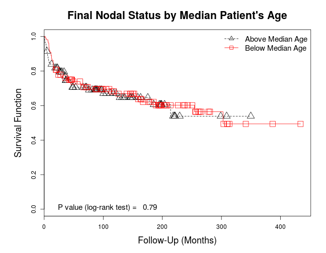 

```r
# By urethral invasion
with(Data, survival.plot(Urethra, FollowUp, Status, title = "Final Nodal Status by Urethral Invasion"))
```

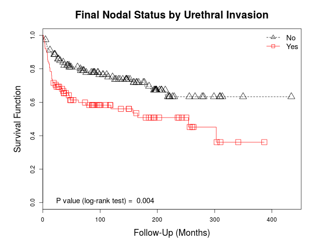 

```r
# By vascular invasion
with(Data, survival.plot(Vascular, FollowUp, Status, title = "Final Nodal Status by Vascular Invasion"))
```

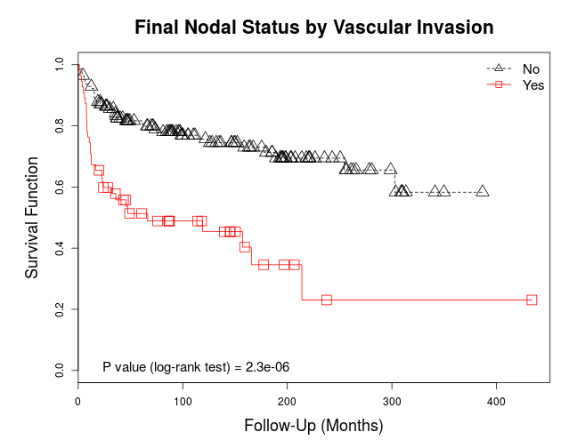 

```r
# By perineural invasion
with(Data, survival.plot(Perineural, FollowUp, Status, title = "Final Nodal Status by Perineural Invasion"))
```

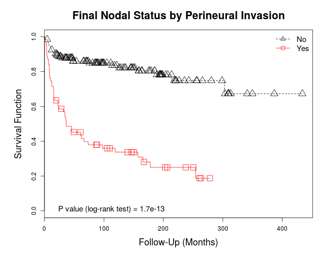 

```r
# By pathological T stage
with(Data, survival.plot(pT, FollowUp, Status, title = "Final Nodal Status by Pathological T Stage"))
```

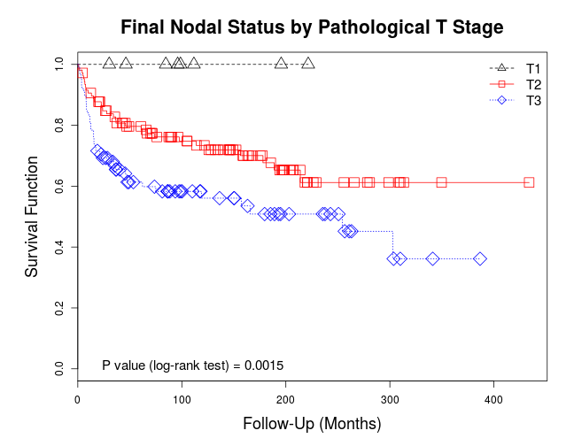 

```r
# By clinical N stage positivity
with(Data, survival.plot(cN_Positive, FollowUp, Status, title = "Final Nodal Status by Clinical N Stage Positivity"))
```

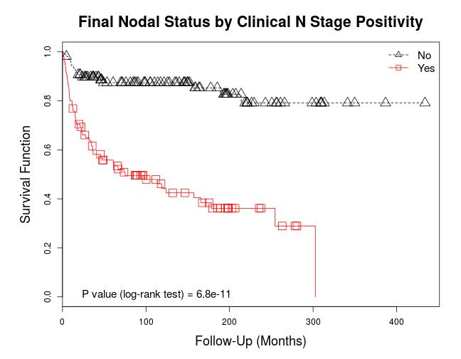 

```r
# By Solsona et al risk groups
with(Data, survival.plot(Solsona, FollowUp, Status, title = "Final Nodal Status by Solsona et al Risk Groups", position = "bottomright"))
```

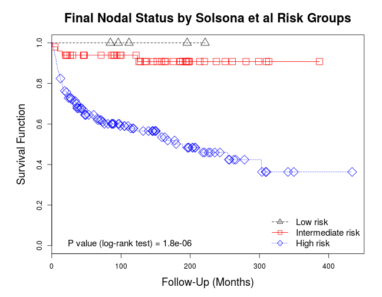 

```r
# By EAU risk groups
with(Data, survival.plot(EAU, FollowUp, Status, title = "Final Nodal Status by EAU Risk Groups"))
```

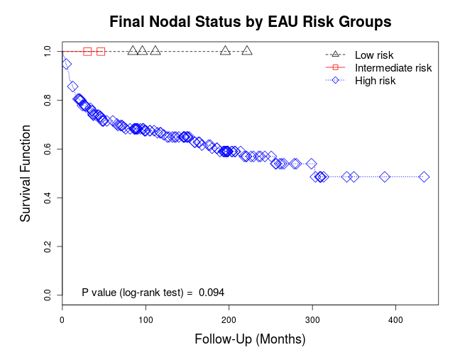 

```r
# By Hungerhuber et al risk groups
with(Data, survival.plot(Hungerhuber, FollowUp, Status, title = "Final Nodal Status by Hungerhuber et al Risk Groups"))
```

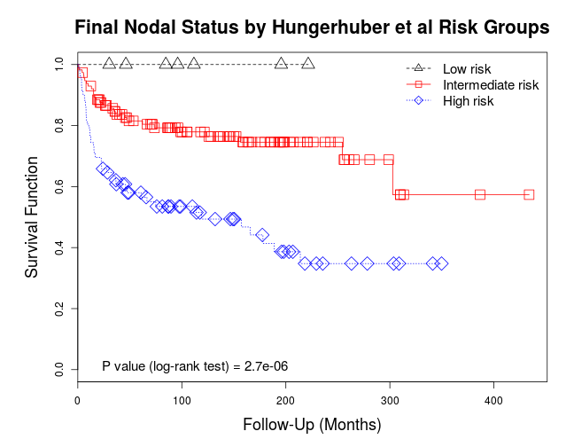 

### <a name="SurvivalDOD">Survival Analysis: Cancer-Related Death</a>

```r
# Defining outcome variable
Status <- Data$DOD
# By surgical procedure
with(Data, survival.plot(Procedure, FollowUp, Status, title = "Cancer-Related Death by Surgical Procedure", position = "bottomright", ylim = c(0.5, 1)))
```

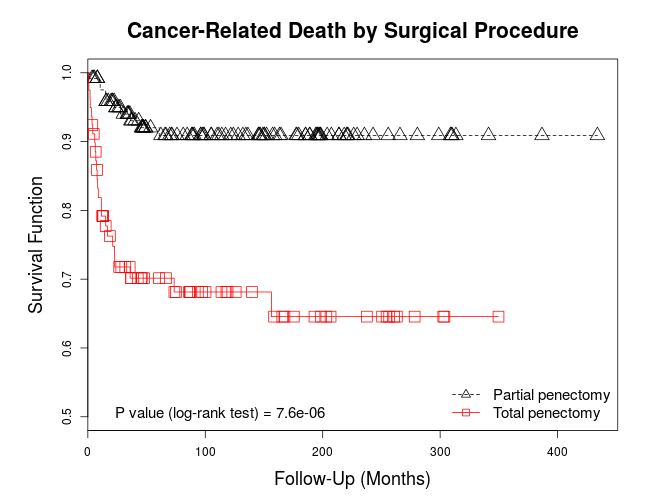 

```r
# By histologic grade
with(Data, survival.plot(Grade, FollowUp, Status, title = "Cancer-Related Death by Histologic Grade", position = "bottomright", ylim = c(0.5, 1)))
```

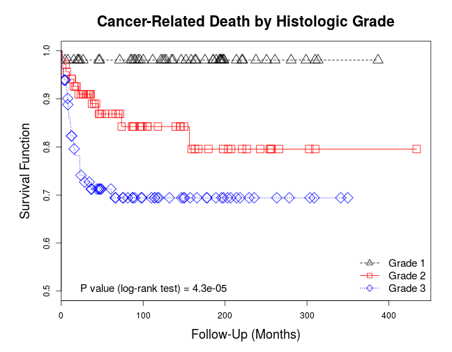 

```r
# By glans invasion
with(Data, survival.plot(Glans, FollowUp, Status, title = "Cancer-Related Death by Glans Invasion", ylim = c(0.5, 1)))
```

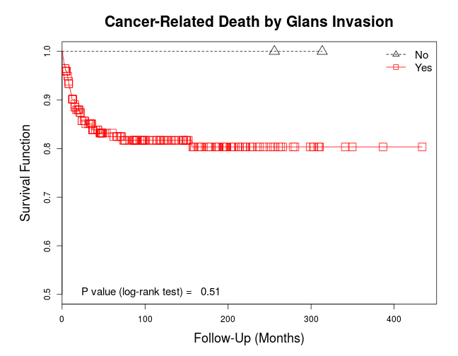 

```r
# By coronal sulcus invasion
with(Data, survival.plot(Sulcus, FollowUp, Status, title = "Cancer-Related Death by Coronal Sulcus Invasion", ylim = c(0.5, 1)))
```

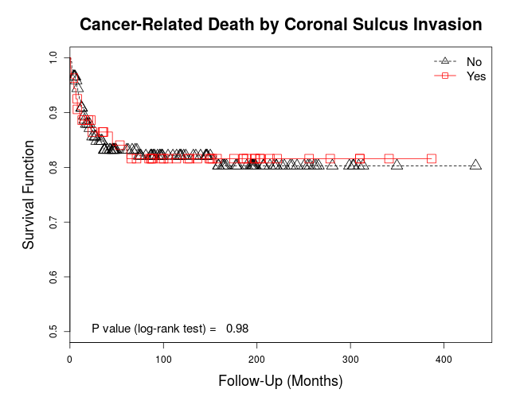 

```r
# By foreskin invasion
with(Data, survival.plot(Foreskin, FollowUp, Status, title = "Cancer-Related Death by Foreskin Invasion", ylim = c(0.5, 1)))
```

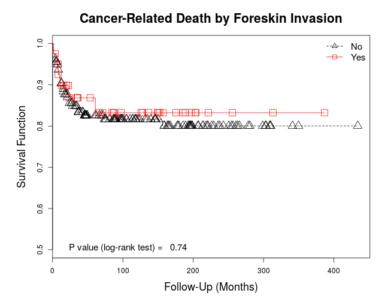 

```r
# By anatomical level
with(Data, survival.plot(Level, FollowUp, Status, title = "Cancer-Related Death by Anatomical Level", position = "bottomright", ylim = c(0.5, 1)))
```

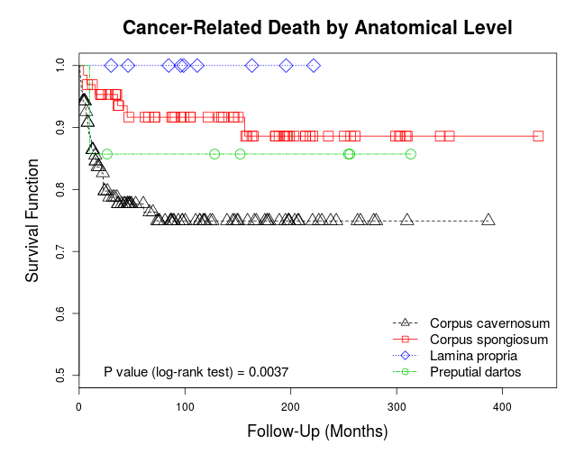 

```r
# By median tumor thickness
with(Data, survival.plot(Thickness_Median, FollowUp, Status, title = "Cancer-Related Death by Median Tumor Thickness", ylim = c(0.5, 1)))
```

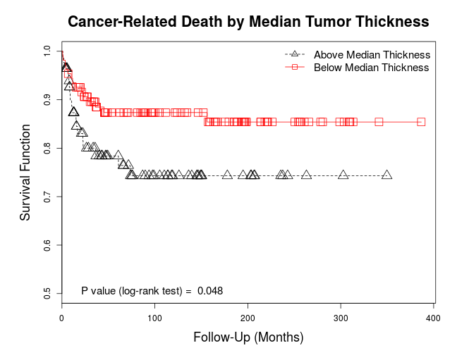 

```r
# By median patient's age
with(Data, survival.plot(Age_Median, FollowUp, Status, title = "Cancer-Related Death by Median Patient's Age", ylim = c(0.5, 1)))
```

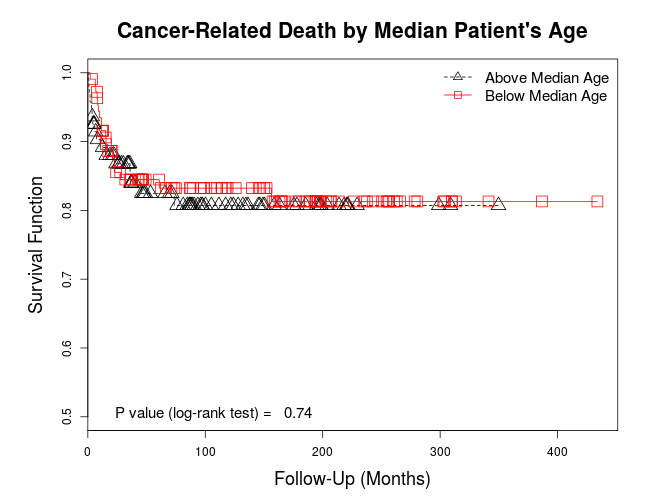 

```r
# By urethral invasion
with(Data, survival.plot(Urethra, FollowUp, Status, title = "Cancer-Related Death by Urethral Invasion", ylim = c(0.5, 1)))
```

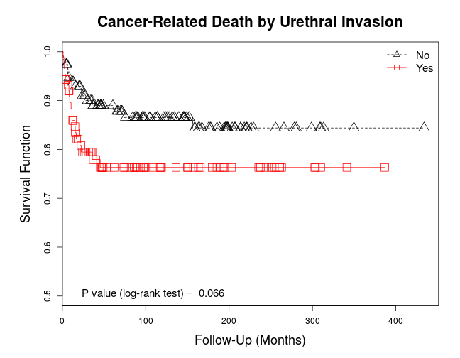 

```r
# By vascular invasion
with(Data, survival.plot(Vascular, FollowUp, Status, title = "Cancer-Related Death by Vascular Invasion", ylim = c(0.5, 1)))
```

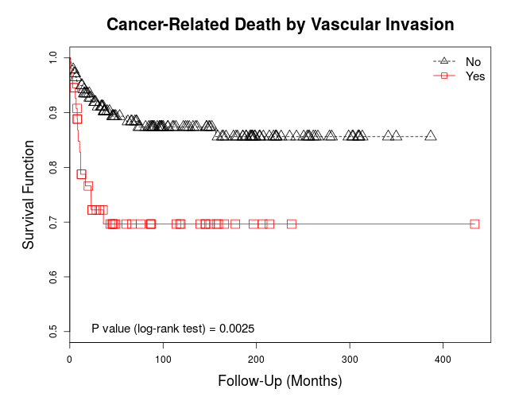 

```r
# By perineural invasion
with(Data, survival.plot(Perineural, FollowUp, Status, title = "Cancer-Related Death by Perineural Invasion", ylim = c(0.5, 1)))
```

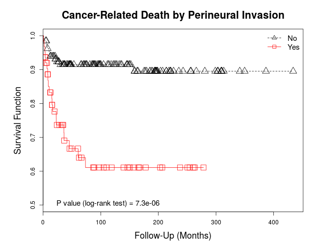 

```r
# By pathological T stage
with(Data, survival.plot(pT, FollowUp, Status, title = "Cancer-Related Death by Pathological T Stage", ylim = c(0.5, 1)))
```

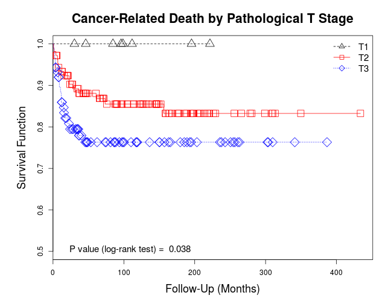 

```r
# By tumor relapse
with(Data, survival.plot(Relapse, FollowUp, Status, title = "Cancer-Related Death by Tumor Relapse", position = "bottomright"))
```

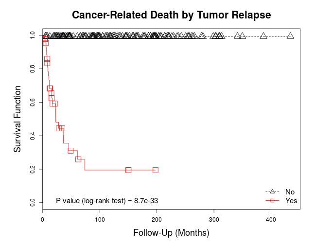 

```r
# By local tumor relapse
with(Data, survival.plot(Local, FollowUp, Status, title = "Cancer-Related Death by Local Tumor Relapse"))
```

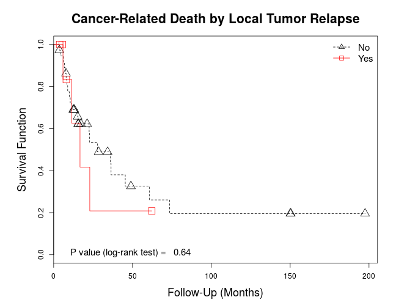 

```r
# By regional tumor relapse
with(Data, survival.plot(Regional, FollowUp, Status, title = "Cancer-Related Death by Regional Tumor Relapse"))
```

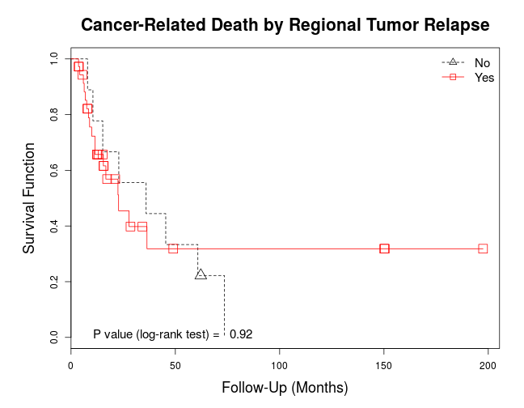 

```r
# By systemic tumor relapse
with(Data, survival.plot(Systemic, FollowUp, Status, title = "Cancer-Related Death by Systemic Tumor Relapse"))
```

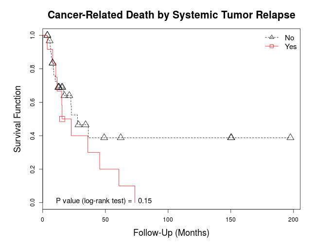 

```r
# By clinical N stage positivity
with(Data, survival.plot(cN_Positive, FollowUp, Status, title = "Cancer-Related Death by Clinical N Stage Positivity", ylim = c(0.5, 1)))
```

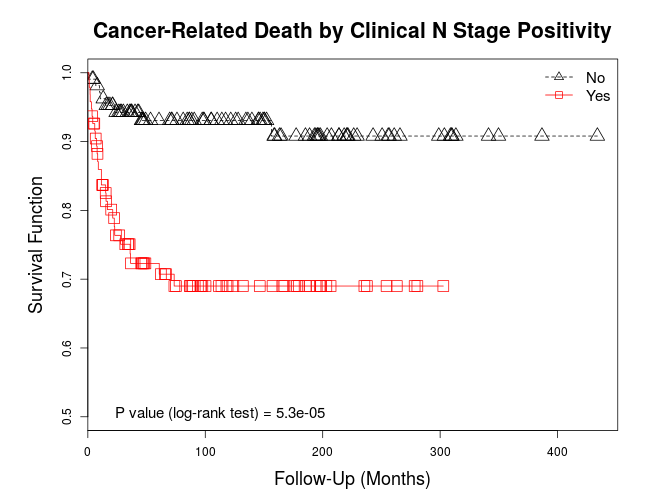 

```r
# By Solsona et al risk groups
with(Data, survival.plot(Solsona, FollowUp, Status, title = "Cancer-Related Death by Solsona et al Risk Groups", position = "bottomright", ylim = c(0.5, 1)))
```

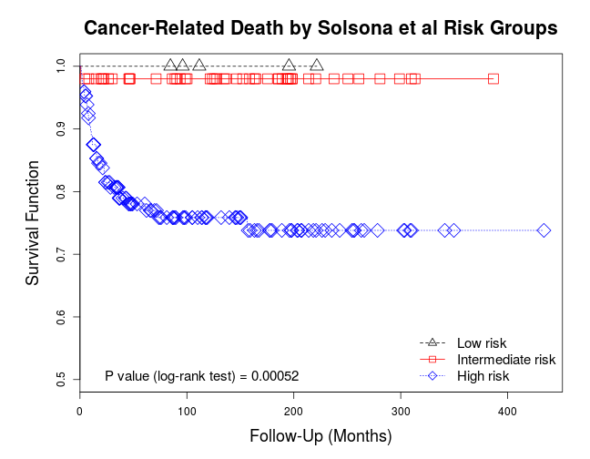 

```r
# By EAU risk groups
with(Data, survival.plot(EAU, FollowUp, Status, title = "Cancer-Related Death by EAU Risk Groups", ylim = c(0.5, 1)))
```

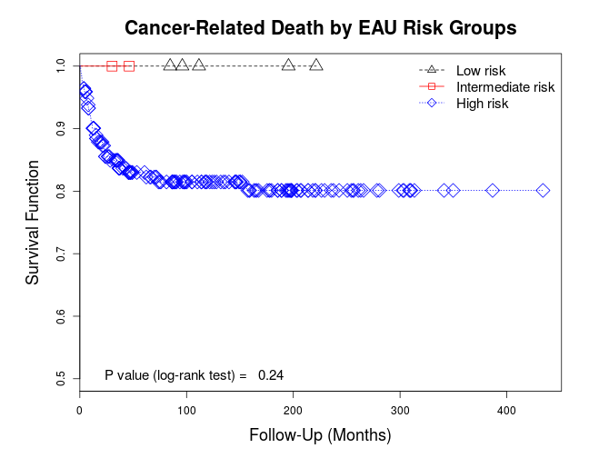 

```r
# By Hungerhuber et al risk groups
with(Data, survival.plot(Hungerhuber, FollowUp, Status, title = "Cancer-Related Death by Hungerhuber et al Risk Groups", ylim = c(0.5, 1)))
```

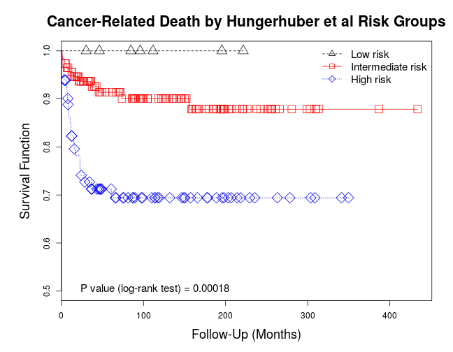 

### <a name="ROCFNS">ROC Curve Analysis: Final Nodal Status</a>

```r
library(pROC)
```

```
## Type 'citation("pROC")' for a citation.
## 
## Attaching package: 'pROC'
## 
## The following objects are masked from 'package:stats':
## 
##     cov, smooth, var
```

```r
# Plots
par(cex = 1.25)
FN_ROC_Solsona <- with(Data, plot.roc(Final_Nodal, Solsona,  main = "Final Nodal Status", lty = 4, col = 4))
FN_ROC_EAU <- with(Data, lines.roc(Final_Nodal, EAU, lty = 2, col = 1))
FN_ROC_Hungerhuber <- with(Data, lines.roc(Final_Nodal, Hungerhuber, lty = 6, col = 2))
legend("bottomright", lty = c(4,2,6), col = c(4,1,2), bty = "n",
       legend = c("Solsona et al system", "EAU system", "Hungerhuber et al system"))
```

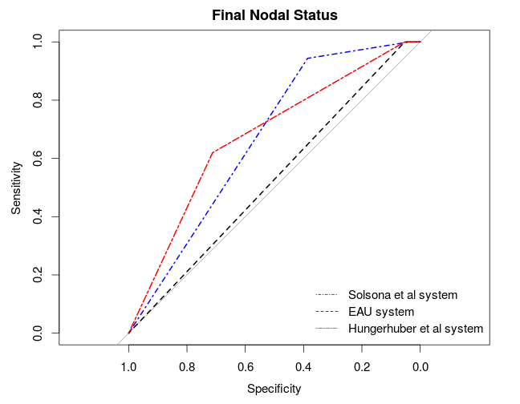 

```r
# Statistics
ROC_FN_Solsona <- round(with(Data, roc(Final_Nodal ~ Solsona, ci = TRUE)$ci), 2)
MW_FN_Solsona <- format(with(Data, wilcox.test(as.numeric(Solsona) ~ Final_Nodal)$p.value), digits = 2)
ROC_FN_EAU <- round(with(Data, roc(Final_Nodal ~ EAU, ci = TRUE)$ci), 2)
MW_FN_EAU <- format(with(Data, wilcox.test(as.numeric(EAU) ~ Final_Nodal)$p.value), digits = 2)
ROC_FN_Hungerhuber <- round(with(Data, roc(Final_Nodal ~ Hungerhuber, ci = TRUE)$ci), 2)
MW_FN_Hungerhuber <- format(with(Data, wilcox.test(as.numeric(Hungerhuber) ~ Final_Nodal)$p.value), digits = 2)
```


Risk Group System | Area Under the ROC Curve | 95% CI | Mann-Whitney's P value 
--- | :---: | :---: | :---:
Solsona _et al_ system | 0.67 | 0.62, 0.72 | 4.6e-07
EAU system | 0.53 | 0.51, 0.55 | 0.049
Hungerhuber _et al_ system | 0.68 | 0.61, 0.74 | 2.1e-06

***

### <a name="ROCDOD">ROC Curve Analysis: Cancer-Related Death</a>

```r
# Plots
par(cex = 1.25)
FN_ROC_Solsona <- with(Data, plot.roc(DOD, Solsona,  main = "Cancer-Related Death", lty = 4, col = 4))
FN_ROC_EAU <- with(Data, lines.roc(DOD, EAU, lty = 2, col = 1))
FN_ROC_Hungerhuber <- with(Data, lines.roc(DOD, Hungerhuber, lty = 6, col = 2))
legend("bottomright", lty = c(4,2,6), col = c(4,1,2), bty = "n",
       legend = c("Solsona et al system", "EAU system", "Hungerhuber et al system"))
```

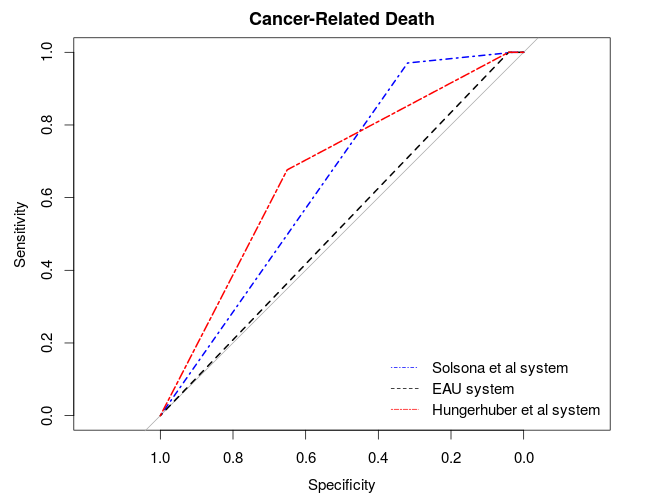 

```r
# Statistics
ROC_DOD_Solsona <- round(with(Data, roc(DOD ~ Solsona, ci = TRUE)$ci), 2)
MW_DOD_Solsona <- format(with(Data, wilcox.test(as.numeric(Solsona) ~ DOD)$p.value), digits = 2)
ROC_DOD_EAU <- round(with(Data, roc(DOD ~ EAU, ci = TRUE)$ci), 2)
MW_DOD_EAU <- format(with(Data, wilcox.test(as.numeric(EAU) ~ DOD)$p.value), digits = 2)
ROC_DOD_Hungerhuber <- round(with(Data, roc(DOD ~ Hungerhuber, ci = TRUE)$ci), 2)
MW_DOD_Hungerhuber <- format(with(Data, wilcox.test(as.numeric(Hungerhuber) ~ DOD)$p.value), digits = 2)
```

Risk Group System | Area Under the ROC Curve | 95% CI | Mann-Whitney's P value 
--- | :---: | :---: | :---:
Solsona _et al_ system | 0.65 | 0.6, 0.69 | 0.00054
EAU system | 0.52 | 0.51, 0.54 | 0.23
Hungerhuber _et al_ system | 0.67 | 0.59, 0.76 | 0.00032

***
